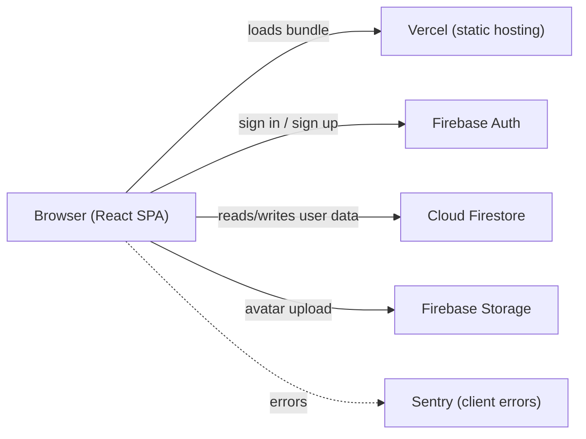

# Pascal — Architecture

> **Source of truth** for cross-cutting technical decisions: directory layout, state management, environment strategy, error handling, and observability. Every spec doc references this file. Decision history: `docs/alternatives.md` (D38–D47).

---

## 1. System overview



- **Frontend:** Vite-built React SPA, deployed to Vercel.
- **Backend:** Firebase managed services (Auth, Firestore, Storage). No custom Node server.
- **Content:** Lesson definitions are TypeScript files bundled into the SPA (see `spec-content-model`). Zero DB reads for lesson content.
- **Observability:** Sentry for client errors; Firebase console for backend health.

---

## 2. Directory layout

```
brilliant-clone/
├── .github/workflows/        # CI
├── docs/
│   ├── prd.md
│   ├── architecture.md       # this file
│   ├── ui-stack.md
│   ├── alternatives.md
│   ├── build-order.md
│   ├── deploy-checklist.md
│   ├── privacy.md
│   └── specs/
│       ├── spec-content-model.md
│       ├── spec-auth.md
│       ├── spec-progress-persistence.md
│       ├── spec-lesson-player.md
│       ├── spec-interactions.md
│       ├── spec-habit-loop.md
│       ├── spec-course-path.md
│       └── spec-profile.md
├── scripts/
│   └── audit-feedback.ts
├── src/
│   ├── content/              # lesson content model (already exists)
│   │   ├── types.ts
│   │   ├── index.ts
│   │   ├── assertLessonInvariants.ts
│   │   └── lessons/
│   ├── lib/
│   │   ├── firebase.ts       # Firebase init + singletons (auth, db, storage)
│   │   ├── motion.ts         # shared Framer Motion timing constants
│   │   ├── hash.ts           # tiny pure hash for variant seeding
│   │   ├── streak.ts         # date math for streaks
│   │   └── xp.ts             # XP rules
│   ├── features/             # one folder per spec
│   │   ├── auth/             # spec-auth
│   │   │   ├── AuthProvider.tsx
│   │   │   ├── RegisterPage.tsx
│   │   │   ├── LoginPage.tsx
│   │   │   ├── useAuth.ts
│   │   │   └── userService.ts
│   │   ├── progress/         # spec-progress-persistence
│   │   │   ├── progressService.ts
│   │   │   ├── useLessonProgress.ts
│   │   │   └── selectVariant.ts
│   │   ├── lesson/           # spec-lesson-player + spec-interactions
│   │   │   ├── LessonPlayer.tsx
│   │   │   ├── SlotRenderer.tsx
│   │   │   └── interactions/
│   │   │       ├── TapOutcomes.tsx
│   │   │       ├── FillFraction.tsx
│   │   │       ├── TapEvent.tsx
│   │   │       ├── GridEvent.tsx
│   │   │       └── MultipleChoice.tsx
│   │   ├── habit/            # spec-habit-loop
│   │   │   ├── CelebrationScreen.tsx
│   │   │   └── habitService.ts
│   │   ├── course/           # spec-course-path
│   │   │   └── HomePage.tsx
│   │   └── profile/          # spec-profile
│   │       └── ProfilePage.tsx
│   ├── components/
│   │   ├── ui/               # shadcn-generated components (do not edit by hand)
│   │   ├── illustrations/    # custom SVGs (die, coin, cards, grid)
│   │   └── AppShell.tsx      # bottom nav + outlet
│   ├── App.tsx               # router + providers
│   ├── main.tsx              # entry point
│   └── index.css             # Tailwind + design tokens
├── firebase/                 # Firebase project artifacts
│   ├── firestore.rules
│   ├── firestore.indexes.json
│   └── storage.rules
├── public/
├── .env.example              # template — never commit real .env
├── eslint.config.js
├── package.json
├── tsconfig.json
├── vite.config.ts
└── vitest.config.ts
```

### Naming conventions
- React components: `PascalCase.tsx` (e.g. `LessonPlayer.tsx`).
- Hooks: `useCamelCase.ts` (e.g. `useAuth.ts`).
- Services (pure functions or thin Firebase wrappers): `camelCaseService.ts`.
- Tests: colocated, `*.test.ts` or `*.test.tsx`.
- Constants files: `camelCase.ts` (e.g. `xp.ts`).

### Where things go
| Kind of code | Goes in |
| --- | --- |
| A page (route target) | `src/features/<feature>/<Name>Page.tsx` |
| A piece of a page (used in one feature) | `src/features/<feature>/` |
| A piece used by 2+ features | `src/components/` |
| A shadcn component | `src/components/ui/` (managed by CLI) |
| A custom SVG illustration | `src/components/illustrations/` |
| A Firebase service wrapper | `src/features/<feature>/<feature>Service.ts` |
| A pure helper (no Firebase) | `src/lib/<name>.ts` |

---

## 3. State management

**Decision:** **React Context for auth + profile; direct Firestore SDK calls (with hooks) for everything else.** No Zustand, no Redux, no Jotai for MVP. See `docs/alternatives.md` D39.

### How it works

- `AuthProvider` (in `src/features/auth/`) wraps the app, exposes `useAuth()` returning `{ user, profile, loading }`. Subscribes to `onAuthStateChanged` and the user's `/users/{uid}` doc via `onSnapshot`.
- Feature-specific data (`lessonProgress`, `stepAttempts`) is read via custom hooks that wrap `onSnapshot` (e.g. `useLessonProgress(lessonId)`). One subscription per active lesson, torn down on unmount.
- Writes go through service functions (`progressService.recordAttempt(...)`, `habitService.awardXp(...)`). Services are pure functions over `db`; no global mutable state.
- Server state IS the source of truth. Firestore's real-time listeners ARE the cache. We do not duplicate state into React Query / SWR for MVP.

### When this would break
- If we add more than ~5 simultaneous Firestore listeners per page, switch to TanStack Query for deduping.
- If we add Phase 2 AI features that need optimistic UI mutations, revisit.

---

## 4. Environment strategy

**Decision:** **One Firebase project for MVP** (dev = prod), with the Firebase emulator suite for local testing. See `docs/alternatives.md` D42.

### Local development
- `.env.local` (gitignored) holds Firebase web SDK config + `VITE_USE_EMULATOR=true`.
- `npm run dev` starts Vite. If `VITE_USE_EMULATOR=true`, `src/lib/firebase.ts` connects to the emulator suite on `localhost:8080` (Firestore), `:9099` (Auth), `:9199` (Storage).
- `firebase emulators:start --import=./firebase/seed --export-on-exit=./firebase/seed` runs the emulators; seed data lives gitignored.

### Production
- One Firebase project, configured via Vercel project environment variables (`VITE_FIREBASE_*`).
- Deploys go through Vercel preview branches; merging to `main` deploys to production.
- Firestore rules and indexes are deployed manually via `firebase deploy --only firestore` until we wire up an action. (Phase 3 candidate.)

### `.env.example` (committed)
```
VITE_FIREBASE_API_KEY=
VITE_FIREBASE_AUTH_DOMAIN=
VITE_FIREBASE_PROJECT_ID=
VITE_FIREBASE_STORAGE_BUCKET=
VITE_FIREBASE_MESSAGING_SENDER_ID=
VITE_FIREBASE_APP_ID=
VITE_USE_EMULATOR=false
VITE_SENTRY_DSN=
```

### Risk
- Single-project means a buggy dev write can pollute "prod" data. Mitigation: every developer runs against the emulator by default; only Vercel uses the real project.

---

## 5. Routing

React Router v6. Route table:

| Path | Component | Auth required |
| --- | --- | --- |
| `/` | `HomePage` (course path) | yes |
| `/login` | `LoginPage` | no (redirect to `/` if signed in) |
| `/register` | `RegisterPage` | no (redirect to `/` if signed in) |
| `/lesson/:lessonId` | `LessonPlayer` | yes |
| `/profile` | `ProfilePage` | yes |
| `*` | 404 → redirect to `/` | n/a |

Auth gating: a single `<RequireAuth>` wrapper inside `App.tsx` redirects unsigned users to `/login`.

---

## 6. Error handling

### Client-side errors
- **Sentry** (`@sentry/react`) initialized in `main.tsx` when `VITE_SENTRY_DSN` is set. Catches uncaught errors and unhandled promise rejections.
- **React error boundary** at `<App>` root renders a generic "Something broke. Tap to reload." card. Logs to Sentry.

### Firestore write failures
- Every service write returns `Promise<{ ok: true } | { ok: false; error: string }>`.
- Lesson player shows an inline toast on persistence failure ("Couldn't save your answer — check your connection. Will retry.").
- One automatic retry with 500ms backoff before surfacing the error.

### Network offline
- We do **not** enable Firestore offline persistence in MVP (see alternatives D25).
- A simple `navigator.onLine` check shows a banner "You're offline — your answers will not save." while offline.

### Validation errors
- Form-level validation (registration password, etc.) renders inline below the field. No toasts for validation.

---

## 7. Observability

### Production
- **Sentry** for client errors (free tier ample for MVP).
- **Firebase console** for Firestore read/write counts, Auth signups, Storage usage. Set a budget alert at $20/mo on Firebase.
- **Vercel analytics** (free tier) for basic traffic + Core Web Vitals.

### Development
- `console.error` is acceptable. Sentry is off (no DSN in `.env.local`).
- `npm run audit-feedback` prints the hand-written-hint backlog.

### Out of scope for MVP
- Custom analytics events (Phase 2).
- Distributed tracing.
- Server-side logging (we have no server).

---

## 8. Performance budget

Per PRD §7:
- **Interactive < 2s** on a mid-range phone over 4G.
- **Feedback < 100ms** after a Check tap.
- **60 FPS** during grid taps.

### How we hit it
- Vite code-splits per route automatically. Lesson content is one bundle (small — JSON-ish data).
- Firebase JS SDK is heavy (~150KB gz). Loaded eagerly because every page needs auth state.
- `@fontsource/inter` for self-hosted Inter; preload one weight (400) eagerly, defer the rest.
- No images in the critical path — illustrations are inline SVGs.
- Lighthouse mobile target ≥ 90 for Performance, Accessibility, Best Practices.

### Bundle size budget
- Total first-load JS: **< 300KB gz**. CI does not yet enforce this; track manually until budget is wired.

---

## 9. Testing strategy

| Level | Tool | What it covers |
| --- | --- | --- |
| Unit | Vitest | Pure functions (`hash`, `streak`, `xp`, `selectVariant`, `assertLessonInvariants`). |
| Content | Vitest | Every lesson passes `assertLessonInvariants`. |
| Integration | Firebase emulator + Vitest | Security rules: a user can read their own progress, not another's. |
| E2E | (not in MVP) | Phase 3 candidate — Playwright. |
| Manual | Real phone | The brief's 5 scenarios, run against the deployed URL before declaring done. |

CI runs `typecheck + lint + format:check + test` on every push (see `.github/workflows/ci.yml`).

---

## 10. Coding standards

- TypeScript `strict: true` (already set in `tsconfig.json`).
- ESLint flat config with `typescript-eslint/recommended`; `--max-warnings=0`.
- Prettier formats everything; CI fails on format drift.
- Imports: type-only imports use `import type`.
- No default exports for components (`export function LessonPlayer` not `export default`).
- No `any` without a `// eslint-disable-next-line` and a comment explaining why.

---

## 12. Engineering guardrails

> The point of these rules is to make agents (and humans) **fail loudly instead of silently**. If you find yourself reaching for a workaround that violates one of these, stop and log it in `docs/issues.md` instead.

### 12.1 No silent catches
Every `try`/`catch` must do **one of**:
1. Rethrow (`throw e`),
2. Return a discriminated-union error (`{ ok: false, error: ... }`),
3. Surface a user-visible signal (toast via `sonner`, inline error, error boundary fallback), AND log to Sentry.

A bare `catch (e) {}` or a `catch (e) { console.log(e) }` is **prohibited**. ESLint should fail on empty catch blocks (`no-empty` with `allowEmptyCatch: false`). If the third option is used, the log call is not optional.

### 12.2 No infinite or unbounded retries
Every retry loop has:
- A **maximum attempt count** (default: 1 retry on Firestore writes per architecture §6).
- A **backoff strategy** (default: 500ms fixed; use exponential only when justified).
- A **terminal user-visible failure** when the cap is hit ("Couldn't save. Tap to retry.").

`while (true)` is prohibited in any code that calls Firebase, fetch, or any IO. Use `for (let i = 0; i < MAX; i++)` with explicit bounds.

### 12.3 Loading, empty, error, and ready are four states — never collapse them
Hooks that return data must use a discriminated status:

```ts
type LoadState<T> =
  | { status: 'loading' }
  | { status: 'error'; error: string }
  | { status: 'empty' }
  | { status: 'ready'; data: T };
```

`data === undefined` is **not** an acceptable substitute for the loading state. `data === []` is **not** the empty state by default — the hook must decide. UI must render distinct affordances for each state (skeleton, error card, empty card, real content).

### 12.4 Stop and ask on ambiguity
If a spec leaves a real ambiguity (two valid interpretations both consistent with the text), **stop**.
1. Open `docs/issues.md`.
2. Add an entry under "Open" with `Type: ambiguity`, citing the spec line.
3. Propose your best-guess answer with reasoning.
4. Ask in chat.

Do **not** pick one silently. Do **not** "leave it for later" without a logged issue.

### 12.5 No ad-hoc design or product decisions
Before inventing anything (a copy string, a color, an animation duration, a defaulting rule), check in order:
1. The relevant spec.
2. `docs/ui-stack.md`.
3. `docs/alternatives.md` (search by keyword — it's the running decision log).
4. `docs/prd.md`.

If the answer isn't there, that's a `needs-decision` issue. Log it in `docs/issues.md`, propose, and ask. Decisions that ship without being logged are technical debt; they always come back.

If you *do* need to pick a small visual default to keep moving (e.g. one of two icon names), log it as a `Closed — ad-hoc-decision` entry in the issues doc the same day. This keeps drift auditable.

### 12.6 TODO placeholders are loud, not invisible
Hand-written feedback strings the user will author themselves are wrapped with the `FEEDBACK_TODO()` helper from `src/content/types.ts`:

```ts
import { FEEDBACK_TODO } from '@/content/types';

feedbackCorrect: FEEDBACK_TODO('praise for spotting all 6 faces — user will write'),
```

The helper renders as `[TODO] <note>` so a placeholder shipping to a real user is impossible to miss. `npm run audit-feedback` enumerates every placeholder; CI will fail on a non-empty list before launch (see `docs/issues.md` I007).

Implementer rule: **do not invent feedback copy**. If a variant needs feedback you don't have, use `FEEDBACK_TODO()` and move on. Authoring is the user's job.

### 12.7 Surface failures; do not swallow types
- `as any` is prohibited without an `// eslint-disable-next-line` comment that explains *why* the type system can't express the case.
- `as unknown as Foo` is prohibited entirely — that pattern always hides a real bug.
- A failed `assertLessonInvariants` throws in dev; logs to Sentry in prod. Do not catch this.
- Form validation errors render inline, not as toasts (architecture §6.4). Persistence errors render as toasts. Do not mix.

### 12.8 Read the issues doc before starting a task; append as you go
First action on any task: read `docs/issues.md` for open items in the area you're touching. Last action on any task: review your own work and log anything you noticed that wasn't worth fixing inline.

If your task closes an issue, move it from "Open" to "Closed" with a one-line resolution.

### 12.9 Each spec ships independently — do not pre-build downstream pieces
`docs/build-order.md` defines the dependency graph. Do not start a spec before its dependencies are shipped (per the graph). Do not "drop in" code from a future spec because it'd be convenient. If a downstream piece is needed earlier than the order allows, that's an issue to log, not a license to reorder silently.

### 12.10 Tests are part of "done"
A spec is not complete until:
- Its "Test plan" scenarios execute (unit tests for pure functions; emulator tests for security rules; manual evidence for UI flows).
- `npm run verify` (typecheck + lint + tests) passes.
- The spec's edge cases are handled in code, not deferred.

Shipping a spec without its tests creates I-numbered debt before the spec is even merged.

### 12.11 Follow `docs/ui-directive.md` for every shipped string and visual choice
`docs/ui-directive.md` is the source of truth for voice and visual judgment. It overrides any conflicting guidance elsewhere.

**Scope:** the directive's hard rules apply to **every string that ships to a learner** (UI copy, error messages, lesson content, button labels, empty states, toasts, accessible labels) and to **every visual choice** (layout, color, typography, motion).

**Scope clarification:** internal docs (spec narrative, architecture prose, alternatives log) are not retroactively rewritten for em-dash or vocabulary compliance — but new internal-doc writing should follow the directive's voice so the tone stays consistent.

**Before shipping any UI or copy change, self-audit against the directive:**
1. No em dashes. Anywhere in shipped strings.
2. No banned vocabulary (elevate, seamless, leverage, unlock, empower, effortless, supercharge, harness, streamline, cutting-edge, game-changing, revolutionize, dive in, the power of, etc.).
3. No emoji in headings or as bullets unless explicitly brand-approved.
4. No subtitles / taglines / helper text added because a slot exists.
5. No three-adjective rhythm, no rhetorical-question headings.
6. Sentence case, plain verbs, exclamation marks only where genuinely warranted.
7. No visual defaults from the forbidden list (cream + serif + terracotta, dark + neon, blue-to-purple gradient, glassmorphism, broadsheet hairlines, centered-hero-with-two-buttons, three-feature-cards-in-a-row, big-number-with-small-label stat block, uniform radius + drop shadow on every surface).
8. Chanel's rule: review the result and remove one thing before declaring done.

Violations are not "polish for later." A shipped em dash or a stock visual is a failed task. Add an `Open — bug` entry to `docs/issues.md` if you find one after merge.

---

## 13. References

- **PRD** — `docs/prd.md` (what we're building, why).
- **UI stack** — `docs/ui-stack.md` (visual / motion implementation).
- **Alternatives log** — `docs/alternatives.md` (every decision, rationale, gaps).
- **UI directive** — `docs/ui-directive.md` (voice and visual judgment; overrides any conflicting guidance).
- **Issues log** — `docs/issues.md` (open issues, ambiguities, blockers — the implementer's daily companion).
- **Data schema** — `docs/data-schema.md` (consolidated Firestore + Storage reference).
- **Specs** — `docs/specs/spec-*.md` (one per feature, junior-engineer implementation guides).
- **Build order** — `docs/build-order.md` (the dependency graph for shipping the 7 features).
- **Deploy checklist** — `docs/deploy-checklist.md` (verification gates — pending).
