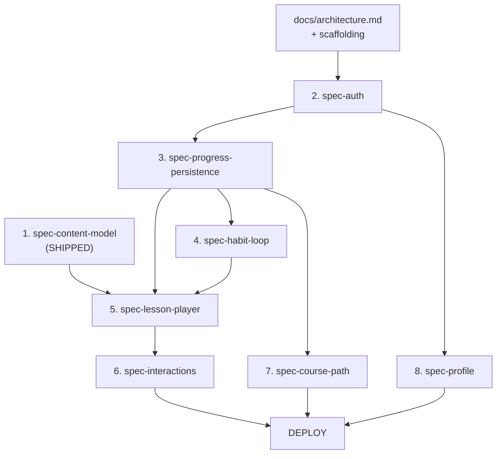

# Build Order

> The dependency graph for Phase 1. Build each spec in order; do not start a downstream spec before its dependencies have shipped (or are stubbed enough to compile against).

---

## Dependency graph

---

## Why this order

| # | Spec | Why now |
| --- | --- | --- |
| 0 | `docs/architecture.md` + scaffolding | Everyone needs the directory layout, state mgmt convention, env strategy, and `lib/firebase.ts` before writing any feature code. |
| 1 | `spec-content-model` (✓ shipped) | Everything that renders or persists references `Lesson` / `Slot` / `Variant`. Already done. |
| 2 | `spec-auth` | No other Firestore feature works without an authenticated `uid`. Username uniqueness, login flow, profile creation. |
| 3 | `spec-progress-persistence` | Defines the Firestore schema (`lessonProgress`, `stepAttempts`), security rules, variant selection, rate limits. The lesson player and habit loop both write through this layer. |
| 4 | `spec-habit-loop` | XP, streak, milestone math. Lives between progress writes and UI updates. Built before the player so the player can call into it. |
| 5 | `spec-lesson-player` | Orchestrates the rendering of one slot at a time. Calls into progress + habit loop. Renders concept/wrap slots itself. |
| 6 | `spec-interactions` | The 5 variant renderers the lesson player plugs in. Largest spec by surface area; build last among player work because the player API stabilizes first. |
| 7 | `spec-course-path` | Home screen. Reads `lessonProgress` for the lesson cards. Decides the "Continue / Start" hero card. |
| 8 | `spec-profile` | Reads denormalized stats from `/users/{uid}` and `milestonesReached`. Avatar upload to Storage. |

---

## Parallelizable work

Once **spec-auth** is shipped:

- `spec-progress-persistence` and `spec-profile` *can* be built in parallel by different agents — they share `/users/{uid}` but touch different subcollections / fields.
- `spec-interactions` variant renderers (5 of them) can be parallelized within the same spec; the `GridEvent` is the hardest and should be implemented first to surface any player-API gaps.

Everything else is serial.

---

## Definition of Done per spec

Each spec is "done" when:

1. All bullets in its **Implementation outline** are checked off.
2. The **Test plan** scenarios pass with evidence (`npm test` output or manual verification screenshot).
3. The **Edge cases** are handled in code.
4. The spec's content has been mirrored into running code (no orphan plan).
5. `npm run verify` (typecheck + lint + test) passes.
6. **UI directive self-audit** — every string this spec ships passes the `docs/ui-directive.md` rules (no em dashes, no banned vocabulary, no exclamations except where deliberately warranted, no AI-default visual clichés). Verify with `rg "—" src/` against your diff before declaring done.
7. **Issues log review** — any ambiguity hit during the spec is logged in `docs/issues.md`, and any closed item is moved out of "Open".

---

## Gate before deploy

`docs/deploy-checklist.md` is the final gate. Do not deploy until every item there is green with evidence.
