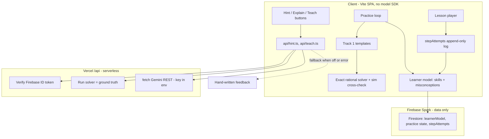

# Pascal — Phase 2 PRD (AI layer)

> **Phase 2 only.** This document is the user-facing contract for the AI features added on top of the shipped Phase 1 MVP. Phase 1 stays the source of truth for everything below the AI layer — read [`docs/prd.md`](prd.md) first; this doc is additive. Implementation details live in the new specs ([`spec-practice`](specs/spec-practice.md), [`spec-learner-model`](specs/spec-learner-model.md), [`spec-ai-assist`](specs/spec-ai-assist.md)). Decision history lands in [`docs/alternatives.md`](alternatives.md) (D92+). The Brainlift outline lives in [`docs/brainlift-phase2.md`](brainlift-phase2.md).

---

## Table of contents

1. [Mission](#1-mission)
2. [Audience tie-in](#2-audience-tie-in)
3. [Non-negotiables](#3-non-negotiables)
4. [Decided feature set](#4-decided-feature-set)
5. [UX walkthrough (a Phase 2 session)](#5-ux-walkthrough-a-phase-2-session)
6. [Architecture summary](#6-architecture-summary)
7. [Workflow (where each AI feature plugs in)](#7-workflow-where-each-ai-feature-plugs-in)
8. [Learning-science grounding](#8-learning-science-grounding)
9. [Acceptance criteria](#9-acceptance-criteria)
10. [Out of scope (Phase 2)](#10-out-of-scope-phase-2)
11. [Cross-cutting edge cases](#11-cross-cutting-edge-cases)
12. [Companion documents](#12-companion-documents)

---

## 1. Mission

Add an AI layer to Pascal that is **grounded** (every feature reads structured lesson state, never raw text), **verified** (every served number comes from a code solver, never the model), and **additive** (the MVP keeps teaching with AI turned off). The AI helps the learner _think harder_, not less — it never solves problems for them, it never grades free-form explanations holistically, and it never invents a number the curriculum is going to judge.

Concretely, Phase 2 unlocks the four candidates the brief called out — _new practice problems, targeted hints, adaptation, wrong-answer explanations_ — and adds one ambitious "ship if ahead" feature grounded in the learning-science notes: the **protege effect** done in a way that doesn't collapse into LLM flattery (the "teach the recruit" surface).

---

## 2. Audience tie-in

The Phase 1 persona stands: a high-school first-timer on probability, attention measured in minutes. Phase 2 leans into two facts about that persona:

- **They will exhaust 5 hand-authored lessons in a week.** Without unlimited practice the course visibly runs dry. The headline AI win is _the course never runs dry_, not "we added a chatbot."
- **They are motivated but insecure** about a math subject they haven't seen in school. Specific feedback — "you fell for the gambler's fallacy" — beats generic "Try again." So the second AI win is _every wrong answer gets explained in terms of what they actually did_.

These two wins drive every decision below.

---

## 3. Non-negotiables

1. **Correctness comes from code, never from an LLM.** The subject is computable; the source of truth for any answer is a deterministic solver. The model phrases prose around code-computed quantities, never the other way around. (Inherits [`spec-practice`](specs/spec-practice.md) §"Non-negotiable principle.")
2. **AI is additive, not a replacement.** Every AI surface has a hand-written fallback. A single `VITE_AI_ENABLED=false` flag must keep the app fully teachable.
3. **Grounded in structured state, never free text.** All prompts read from the `Lesson`/`Slot`/`Variant` shape ([`src/content/types.ts`](../src/content/types.ts)) and the learner's `answerPayload` from the existing `stepAttempts` log — not a paragraph of HTML. (Brief requirement.)
4. **The LLM is a student, never a judge.** Where the learner produces free text (e.g. teaching the recruit), the LLM maps onto a hand-authored rubric and a code-verified transfer problem decides "did they get it." Holistic praise is forbidden.
5. **No model SDK in the client bundle, no key in the build.** Inherits PRD §9.10 AC #1 _literally_: AI runs in a Vercel serverless function, calls Gemini via plain `fetch` to the REST endpoint. `git grep` over the bundle stays clean.
6. **Privacy posture preserved.** Prompts send structured slot data + the learner's anonymized `answerPayload` + weak-skill ids. No name, no email, no `uid`, no free-typed PII.

---

## 4. Decided feature set

The brief asked us to _choose_ AI features that genuinely help, not bolt on a chatbot. Three features form the spine; two are stretch.

### Spine (must ship for Phase 2)

#### F1 — Adaptive infinite practice (Track 1 generators)

Unlimited probability problems generated client-side from in-repo **parameterized templates**. Each template ships `sample → render → solve → explain`; `solve()` is plain code and is the single source of truth for the answer. Adaptive difficulty serves problems near the learner's per-skill rating (target ~20–30% miss rate, _not_ "hardest possible").

- **Unlocks** the existing "Arriving Friday" stub at [`src/features/practice/PracticePage.tsx`](../src/features/practice/PracticePage.tsx). _(Built; live at `/practice`.)_
- **No runtime LLM call.** The LLM's role was offline, authoring template prose (reviewed by a human).
- **Correct by construction**, cross-checked at build time by Monte-Carlo simulation reusing [`src/lib/simulations.ts`](../src/lib/simulations.ts).
- **XP scales with difficulty** — Easy 3 / Medium 5 / Hard 8 / Expert 12, daily-capped (decision D100), so harder problems pay more without grinding dwarfing the path.
- **Stats surfaced on the page** — the learner's level + XP-to-next, the per-topic adaptive Elo rating with its live delta, session XP, correct-streak, and per-problem difficulty.

This is the brief's _"generate new practice problems at the right difficulty so the course never runs dry"_ — done in the only way that satisfies the correctness rule.

#### F2 — Personalized hint / wrong-answer explanation

A Vercel serverless function takes the learner's actual `answerPayload`, the slot's structured state, the learner's recent weak skills + misconceptions, and the code-computed correct answer, and asks Gemini to **phrase a hint or explanation tuned to what the learner actually did** — never revealing the answer in hint mode, always grounded in the verified answer in explanation mode.

- Lives at `/api/hint`. Token-verified, key server-side only.
- Triggers: the existing "after 2 strikes" hint slot in the lesson player ([`spec-lesson-player`](specs/spec-lesson-player.md) §Feedback area), and after a wrong answer in practice.
- **Fallback** on any failure / quota / `aiEnabled=false`: the hand-written `feedbackByWrong*` / `explanation` already in the content.

This is the brief's _targeted hint_ + _explain a wrong answer in plain language tuned to what the learner actually did_ — collapsed into one surface because they share the same prompt shape.

#### F3 — Per-learner model (TWO ENGINES)

A small owner-only Firestore model (`users/{uid}/learnerModel/state`) with **two distinct engines** (decision D94 + the two-engine resolution):

- **Engine A — mastery (Elo).** Per-skill rating + recency-weighted accuracy, fed **only by practice** (deliberate, spaced retrieval). Drives adaptive difficulty (F1), topic auto-select, and which skill F2's hints emphasize.
- **Engine B — exposure / struggle / misconceptions.** Fed by **lesson first-attempts** (review excluded, first committed attempt per slot only — the no-bail-out grind carries no mastery signal). **Engine B never moves the Elo.**

Both materialize from the append-only `stepAttempts` log ([`progressService.ts`](../src/features/progress/progressService.ts)). Surfaced as a **"Strong / Keep working on / Introduced" panel** on `/progress` + Profile (closes the loop — the learner sees the adaptation). Details: [`spec-learner-model`](specs/spec-learner-model.md).

This is the brief's _adapt the path: pick what to do next based on what the learner struggles with_, scoped sensibly: the lesson **spine** keeps its pedagogical order (each lesson earns the next); adaptivity lives in **practice difficulty + topic auto-select + hint targeting**, where it's most pedagogically defensible.

#### F3b — Lesson report card (Engine B payoff)

An immediate, Khan-style "what you nailed / what to watch" recap on the celebration screen, built purely from the lesson session's first-attempt results + the in-repo taxonomy labels (**no AI**). Misconceptions revealed feed Engine B. Spec: [`spec-learner-model`](specs/spec-learner-model.md) (`buildReportCard`).

### Stretch (ship if ahead)

#### F4 — "Teach the recruit" (grounded protege effect)

After a learner finishes a concept, they can tutor a green crew-member ("recruit"). The learner types their explanation; the LLM, in character as the recruit, returns _structured JSON_ mapping the explanation onto a **hand-authored rubric** (3–5 key points): `{ coveredPoints, missingPoints, misconceptionFlags, followUpQuestion }`. Then the recruit attempts a **code-verified transfer problem** — whether it gets it right is driven by rubric coverage, _not_ by LLM flattery.

- The LLM is the _student, not the judge_. The rubric + the transfer problem are the correctness anchors.
- Misconceptions detected here flow into F3.
- **Fallback** when AI is off: the rubric is shown as a self-check.

This is the science-of-learning hook from the notes (protege effect, self-explanation, retrieval) — engineered around the warnings (LLMs over-praise; learners are poor self-judges).

#### F5 — Offline vetted problem bank + session recap (smaller stretch)

A `scripts/practice/` Node pipeline that asks Gemini to draft batches of problems **offline**, then gates each candidate through `solve()` + Monte-Carlo agreement; survivors land in a `practiceProblems/` Firestore collection (public-read, client-write forbidden). End-of-practice "AI recap" is one Gemini call grounded in the learner model ("complements: solid; gambler's fallacy got you twice — queued for tomorrow").

#### F6 — AI difficulty annotation (offline) — planned

An offline batch script that uses an LLM to **estimate problem difficulty** across the bank in one call, validated + human-reviewed, and baked in as a constant the deterministic runtime reads. Difficulty is an _estimate_ (not a correctness claim), so an LLM may produce it — but **offline only, never at runtime**. Data calibration from real attempt data is deferred until there's a user base (it then becomes the posterior on top of the LLM prior). Spec: [`spec-ai-difficulty-annotation`](specs/spec-ai-difficulty-annotation.md) (decision D101).

### Deliberately rejected

Documented in [`docs/brainlift-phase2.md`](brainlift-phase2.md) and [`docs/alternatives.md`](alternatives.md) D92+:

- **Open chatbot.** Off-topic surface, no structured state to ground in, invites hallucination.
- **RAG / vector DB / embeddings.** The corpus is small and structured; relevant context is just "current slot + this learner's model," injected directly. Retrieval has nothing to retrieve.
- **Full lesson-path reordering.** Each Phase 1 lesson is sequenced so the previous tool _breaks down_ — reordering destroys the pedagogy.
- **Live per-request problem generation.** Cost, latency, prompt-injection, and no correctness gate. Wrong direction.
- **Firebase AI Logic client SDK.** Tempting (already in the skills folder) but it puts a model SDK in the client bundle and weakens the "code verifies before the model speaks" story.
- **LLM as final grader of free-form responses.** Sycophancy + correlated errors. The notes explicitly warn against it.

---

## 5. UX walkthrough (a Phase 2 session)

Maya from the Phase 1 walkthrough comes back the next week. She's finished all the authored lessons. Today:

1. **Home** now suggests "Practice your weakest topic: counting (you've been getting compound-event problems wrong)."
2. She taps **Practice**. The first problem is at her level (not too easy, not crushing). She gets it.
3. Next problem, she counts ordered pairs when the question wanted unordered. The hint isn't generic — it's _"You counted pairs like (1, 2) and (2, 1) as different. The question treats them as the same — combinations, not permutations. Try again with the ordered/unordered toggle in mind."_ That hint came from F2, grounded in her actual `answerPayload`.
4. She solves it. The worked solution shows; her **rating goes up**. The mini "growth areas" pill at the top updates: counting moves up one tick.
5. After 5 problems she taps "Teach the recruit." The recruit (a Captain Pascal sidekick) says _"Wait, why does the share settle? Couldn't you get 10 heads in a row again?"_ Maya types her explanation. The recruit replies asking one follow-up about the part she skipped, then attempts a transfer problem and **gets it because Maya covered the missing point** in her follow-up. (If she hadn't, the recruit would have stumbled in the exact spot she skipped — honest feedback.)
6. End of session: a short "AI recap" — "Long-run frequency: solid. Counting: trending up. Gambler's fallacy: caught it twice today, queued in tomorrow's review."
7. She closes the app. **Phase 1 streak / XP / level loop is untouched.** Practice XP is daily-capped per [`practiceXp.ts`](../src/lib/practiceXp.ts) so it can't dwarf the path.

That whole flow is ~7 minutes. Every number she saw came from code. Every prose sentence came from a hand-written line or a model grounded in code-verified state. Nothing was hallucinated.

---

## 6. Architecture summary

Key properties this picture enforces:

- **Where AI runs:** Vercel serverless functions only. `package.json` does **not** add a Gemini SDK — calls are `fetch` to the REST endpoint, key in `process.env.GEMINI_API_KEY` server-side.
- **Where data lives:** Firebase **Spark** stays — no Blaze upgrade, no Cloud Functions. The new collections are owner-only subdocs under `users/{uid}` so they don't touch the tightly-allowlisted `users` update rule (see [`firebase/firestore.rules`](../firebase/firestore.rules)).
- **What the model never does:** decide a graded number. Ever.
- **What the model does:** phrase prose given structured slot data, the learner's `answerPayload`, the learner model summary, and the code-verified answer.
- **Cost:** $0 expected. Gemini AI Studio free tier (no credit card; ~1,500 requests/day on Flash) + Vercel Hobby (1M function invocations/mo). A Project Spend Cap can be set if billing is ever attached.

Detail in [`spec-ai-assist`](specs/spec-ai-assist.md), [`spec-practice`](specs/spec-practice.md), [`spec-learner-model`](specs/spec-learner-model.md).

---

## 7. Workflow (where each AI feature plugs in)

| Feature | Trigger | Inputs (structured) | Source of truth | Fallback (AI off) |
| --- | --- | --- | --- | --- |
| F1 — Adaptive practice | Tap `/practice` | Learner model rating + skill | Template `solve()` (code) | N/A — no LLM at runtime |
| F2 — Hint (lesson) | After 2 wrong on a problem slot | Slot, variant, `answerPayload`, weak skills, **verified correct answer** (server-computed) | Hand-written `feedbackByWrong*` already in content | Show `explanation` per Phase 1 §6 |
| F2 — Explanation (practice) | After a wrong answer in practice | Template, params, learner's submitted answer, **`solve(params)`** | `solve()` + `explain()` already in template | Show `explain()` worked solution unchanged |
| F3 — Learner-model write | Every `recordAttempt` call | `{ slotId, variantId, wasCorrect, misconceptionKey? }` | Append-only `stepAttempts` (already source of truth) | Same — write path is non-LLM |
| F4 — Teach the recruit | "Teach" CTA on a wrap or practice end | Rubric (in-repo), learner's free text, transfer-problem template | Rubric + transfer problem's `solve()` | Self-check rubric panel |
| F5 — Session recap | Practice "end session" | Today's per-skill delta in learner model | Learner model + hand-written summary template | Hand-written template only |

Implementation order (each step ends in a deployable state, AI-off path always intact):

1. **Verification core** — `src/lib/probability/exact.ts` + sim cross-check tests.
2. **Learner model** — skill taxonomy, `Variant.skills?: string[]` tagging, `learnerModelService`, rules, Strengths panel.
3. **Track 1 practice** — templates with `solve`/`explain` + tests, `practiceEngine` adaptive serving, replace [`PracticePage.tsx`](../src/features/practice/PracticePage.tsx) using existing interaction renderers, wire `grantPracticeXp` + learner model.
4. **AI hint / explanation** — `api/hint.ts`, client caller, `VITE_AI_ENABLED` flag + fallback wiring.
5. **Stretch** — `api/teach.ts` + rubric + transfer problem for one concept; offline vetted bank; session recap.

---

## 8. Learning-science grounding

The features above are not "what's possible with an LLM," they are choices justified by the learning-science notes attached to this phase. Stated explicitly so we can audit ourselves:

- **Retrieval is the learning process, not a test of it.** F1's endless practice is _spaced retrieval_; F2's hint forces the learner to retrieve a corrected idea before continuing; F4 makes retrieval _via teaching_, which is the highest-leverage retrieval mode known.
- **Desirable difficulty has a ceiling.** F1's adaptive target is ~20–30% miss rate — explicitly _not_ "hardest possible." Failure >50% demotivates.
- **Performance ≠ learning.** F3 weights _delayed_ retrieval (returning to a skill after a gap) more than first-try-after-teaching. Engagement / time-on-task are _not_ mastery signals.
- **Worked-example effect.** Practice always shows the `explain()`-built derivation after a wrong answer — especially after a miss. (Phase 1's `derivation` shape already supports this.)
- **Pretrieval (guess-before-learn).** Phase 1's `commitOnce` prediction slots stay. Phase 2 doesn't dilute them.
- **Chunking + 4–7 working memory.** Phase 2 adds **no** new on-screen complexity inside a slot; the hint feature lives in the same after-2-strikes affordance Phase 1 already designed for.
- **Interleaving — same domain only.** F1 may interleave skill _types_ within probability (counting / complement / conditional / long-run share); never cross-subject.
- **20% drives 80%.** F1 prioritizes templates for foundational skills first (sample space, complement, conditional, long-run share) before edge topics.
- **LLM cognitive debt.** Hint never reveals the answer; teach-the-recruit never grades holistically. The learner does the thinking; the LLM phrases the nudge.

---

## 9. Acceptance criteria

Each bucket below is the user-observable contract. Specs own the implementation; this owns the contract.

### 9.1 Adaptive practice (F1) — 7 ACs

1. **Unlock visible.** The locked Practice stub at [`PracticePage.tsx`](../src/features/practice/PracticePage.tsx) is replaced; tapping the nav entry opens a working practice surface.
2. **Endless solve loop.** A learner can pick (or auto-receive) a topic and solve an unbounded sequence of problems — see one, answer, get immediate correct/wrong feedback, see a fully worked solution, tap "Next problem," repeat.
3. **Every answer is code-computed.** Every served problem's correct answer comes from `solve()` in the template, not from any model. Verified by a build-time test asserting `solve()` agrees with `simulate()` over ≥1,000 sampled parameter sets per template (and exact enumeration where feasible).
4. **Adaptive difficulty observable.** Streak-of-correct trends difficulty up; misses trend it down. Visible signals: "rating" or "trending" indicator + measurable skill-rating delta in the learner model.
5. **Phase 1 properties hold.** No model SDK in `package.json`; no API key in the client bundle (`git grep` clean, per PRD §9.10 AC #1, preserved literally).
6. **XP integration matches spec.** A correct practice problem awards **difficulty-scaled XP** (Easy 3 / Medium 5 / Hard 8 / Expert 12, decision D100), capped at `PRACTICE_DAILY_XP_CAP` per local day via [`grantPracticeXp`](../src/lib/practiceXp.ts). Does NOT tick the streak; does NOT count as a completed lesson.
7. **Topic auto-suggest.** Home / Practice surfaces suggest the learner's current weakest topic (driven by F3). Tapping it starts practice there.

### 9.2 AI hint / explanation (F2) — 6 ACs

1. **Hint trigger.** In a lesson, after the 2nd wrong attempt on the same slot, if `aiEnabled` and the user has network, the hint copy is replaced by an AI-generated nudge tuned to the learner's actual `answerPayload`. The CTA stays **Check** (no bail-out — preserves PRD AC §9.3 #4).
2. **Hint never reveals the answer.** The model's system prompt forbids stating the correct answer in hint mode. (Tested with adversarial prompts; spot-checked in QA.)
3. **Explanation after wrong (practice).** After a wrong practice answer, the worked solution shows; an AI-generated paragraph on _what the learner specifically got wrong_ appears alongside it (when `aiEnabled`).
4. **Grounded in the verified answer.** The function computes `solve()` server-side first and passes it into the model as ground truth; the model phrases prose around it. No model-only numbers.
5. **AI-off fallback works end-to-end.** With `VITE_AI_ENABLED=false`, both surfaces fall back cleanly to the hand-written `feedbackByWrong*` / `explanation` / `explain()` and the lesson is still completable. Demonstrable by toggling the flag.
6. **No key, no SDK, no PII.** No `@google/generative-ai` (or equivalent) in `package.json`; key only in Vercel env. Request bodies contain no `uid`/email/name (server attaches uid from the verified token for rate limiting; never logged to disk).

### 9.3 Learner model (F3) — 6 ACs

1. **Variants tagged.** Every variant in the live lessons has `skills: string[]` mapping into a small in-repo taxonomy (see [`spec-learner-model`](specs/spec-learner-model.md)). New variants without `skills` log a warning at content-invariant assertion time.
2. **Model updates on every attempt.** Each call to `recordAttempt` ([`progressService.ts`](../src/features/progress/progressService.ts)) updates the per-skill `{ attempts, correct, rating, lastSeenAt }` and any matched `misconceptions[key]` counter.
3. **Owner-only.** The learner-model doc lives at `users/{uid}/learnerModel/state` (subcollection), owner-only via Firestore rules.
4. **Strengths panel visible.** Progress and Profile show a "Strengths / keep working on" panel listing the top 2–3 strongest and 2–3 weakest skills with friendly labels.
5. **Feeds F1 + F2.** Practice's adaptive engine reads `rating`; F2's hint prompt includes the learner's top weakness + most-recent misconception.
6. **Reopens PRD §9.10 #8 deliberately.** PRD §9.10 negative criterion "no mastery scoring / spaced repetition" is reversed for the per-skill rating; the lesson-level 3-state machine (`not_started`/`in_progress`/`completed`) is _unchanged_. Documented in [`alternatives.md`](alternatives.md) (see D94).

### 9.4 Teach the recruit (F4, stretch) — 5 ACs

1. **At least one concept ships with a rubric** (3–5 key points hand-authored), one transfer problem (template-backed), and a working teach surface.
2. **Structured JSON only.** The function returns a typed `{ coveredPoints, missingPoints, misconceptionFlags, followUpQuestion }` shape; nothing else is rendered.
3. **Transfer-problem decides "got it."** The recruit's success is computed by the transfer template's `solve()` against an answer the model attempts using the learner's rubric coverage as context — not by the model's praise.
4. **Misconceptions flow to F3.** `misconceptionFlags` are written into the learner model.
5. **AI-off fallback.** When `aiEnabled=false`, the surface shows the rubric as a self-check and the transfer problem as a normal practice problem. Useful, just less magical.

### 9.5 Verification & safety — 5 ACs

1. **Exact arithmetic oracle.** `src/lib/probability/exact.ts` (exact `Fraction` over `bigint`, `nCr`/`nPr`, factorial) ships with unit tests on known values.
2. **Template tests gate CI.** Each template's `solve()` agrees with Monte-Carlo simulation over ≥1,000 sampled params (or exact enumeration where feasible) in the test suite. A failing template blocks the build.
3. **Token verification.** `/api/hint` and `/api/teach` verify the Firebase ID token; unauthenticated calls return 401.
4. **No live model SDK in client.** `package.json` audit passes.
5. **Privacy posture.** Request bodies contain only structured slot/template/learner-model summaries. No name/email/uid in payload (uid attached from token, not echoed).

---

## 10. Out of scope (Phase 2)

- **Open / general chatbot.** No free-text "ask Pascal anything" surface.
- **RAG / embeddings / vector DB.** The corpus is small and structured; injecting context directly wins.
- **Live per-request problem generation.** Track 2 (offline batched + code-verified) is the only generation path.
- **Lesson-path reordering by AI.** Adaptivity lives in practice difficulty + topic suggestion + hint targeting, not in the curriculum sequence.
- **LLM-only grading of free-form text.** Always paired with a hand-authored rubric + a code-verified transfer problem.
- **Firebase AI Logic / on-client Gemini SDK.** Considered, rejected; would put a model SDK in the client bundle.
- **Bayesian Knowledge Tracing / IRT / Deep Knowledge Tracing.** Phase 3 territory; Elo + accuracy is sufficient for the data volume Phase 2 will see.
- **AI features that gate completion or block progress when offline.** Network failures → fallback, never a hard stop.

---

## 11. Cross-cutting edge cases

| # | Edge case | Resolution |
| --- | --- | --- |
| AI-E1 | **Gemini rate limit hit mid-session** | F2/F4 functions return 429; client falls back to hand-written copy without UI disruption. |
| AI-E2 | **Network drop on hint request** | Same as AI-E1 (fetch error → fallback). The lesson never blocks. |
| AI-E3 | **`aiEnabled=false` flipped at runtime** | Hint and Teach surfaces silently revert to fallback on next render; no reload required. |
| AI-E4 | **Model returns malformed JSON** (F4) | Parse failure → render the AI-off rubric self-check; never trust a parse-failed response. |
| AI-E5 | **Learner-model write fails** | The attempt itself is unaffected (`stepAttempts` is the source of truth); next attempt re-derives the delta and converges. |
| AI-E6 | **Template `solve()` and `simulate()` disagree at test time** | CI fails; template cannot ship. (This is the point of the test.) |
| AI-E7 | **Prompt injection in learner free text (F4)** | The function strips/escapes user text and never echoes model output that contains imperative-looking instructions; the rubric mapping is the only authoritative output. |
| AI-E8 | **Practice variant exhausted** | Engine resamples params; templates are parameterized so the space is large. |

---

## 12. Companion documents

- [`spec-practice`](specs/spec-practice.md) — extended for Phase 2 (Track 1 template schema, adaptive serving math, retrieval-in-4-forms organization, XP wiring).
- [`spec-learner-model`](specs/spec-learner-model.md) — new. Skill + misconception taxonomy, mastery math, Firestore shape, rules.
- [`spec-ai-assist`](specs/spec-ai-assist.md) — new. Vercel function contracts, prompts, AI-off fallback, security, env/secrets.
- [`spec-ai-difficulty-annotation`](specs/spec-ai-difficulty-annotation.md) — new. Offline LLM difficulty estimation, baked-in constants, calibration deferred (F6 / D100–D101).
- [`brainlift-phase2`](brainlift-phase2.md) — Phase 2 Brainlift outline (considered / shipped / left out).
- [`alternatives`](alternatives.md) — Phase 2 entries D92+ (reverses D23; new architecture decisions).
- [`design-iterations`](design-iterations.md) — dated Phase 2 summary entry.
