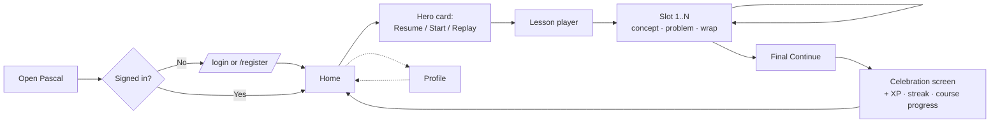
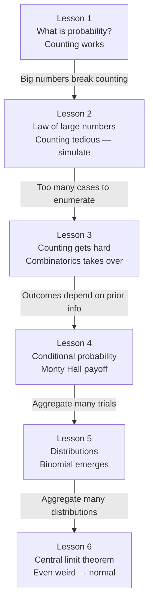

# Pascal — Product Requirements Document (Phase 1)

> **Phase 1 MVP only.** This document is the user-facing contract for what the deployed app must do. Implementation details live in the [`docs/specs/spec-*.md`](specs/) companion docs; decision history lives in [`docs/alternatives.md`](alternatives.md); cross-cutting architecture lives in [`docs/architecture.md`](architecture.md).

---

## Table of contents

1. [Project overview](#1-project-overview)
2. [Concept & audience](#2-concept--audience)
3. [UX walkthrough (a session)](#3-ux-walkthrough-a-session)
4. [UI direction](#4-ui-direction-brilliant-like-clean-but-approachable)
5. [Course strategy](#5-course-strategy)
6. [Habit-loop philosophy](#6-habit-loop-philosophy)
7. [Performance targets](#7-performance-targets)
8. [Out of scope (Phase 1)](#8-out-of-scope-phase-1)
9. [Acceptance criteria](#9-acceptance-criteria)
10. [Cross-cutting edge cases](#10-cross-cutting-edge-cases)
11. [Companion documents](#11-companion-documents)

---

## 1. Project overview

- **Product name:** **Pascal** (after Blaise Pascal, co-founder of probability theory — see D38)
- **Subject:** Probability.
- **Persona:** A high-school student learning probability for the first time. Algebra background, no calculus. Phone in hand, attention measured in minutes.
- **Platform:** **Truly responsive web app (PWA-friendly) — mobile, tablet, and desktop are all first-class** (Pattern B, see D63). Mobile design target is **390 × 844 px** (iPhone 14-class); minimum supported width is **320 px** (iPhone SE, per D65). Scales up via Tailwind breakpoints to tablet (`md:` 768 px) and desktop (`lg:` 1024 px). Bottom nav on mobile → sidebar on tablet/desktop; lesson list grows from 1-col → 2-col → 3-col; interaction touch targets scale 44 → 56 → 64 px. *"PWA-friendly"* means the app loads cleanly in a PWA context but ships no PWA features in MVP (no manifest, no service worker, no offline — per D21 / D25).
- **Stack:** Vite + React 18 + TypeScript + Tailwind + **shadcn/ui** + Framer Motion + React Router + Firebase (Auth, Firestore, Storage) + Vercel.

*Why this stack* lives in [`docs/alternatives.md`](alternatives.md) (D9–D12, D36–D37). *How to use the UI layer* lives in [`docs/ui-stack.md`](ui-stack.md). *Architecture cross-cuts (state, routing, errors, observability, perf budget)* live in [`docs/architecture.md`](architecture.md). *Feature implementation* lives in the spec docs.

---

## 2. Concept & audience

- **One-sentence pitch:** *A learn-by-doing probability app for high-school students who want probability to actually click — not just pass a test.*
- **The core loop:** Open the app → pick up where you left off in a 3–5 minute interactive lesson → get instant hand-written feedback on every tap → finish the lesson → see XP, streak, and course progress update → tomorrow you come back.
- **Problem with the status quo:** Textbook probability is a wall of formulas. Khan-style videos let you stay passive. The famous counterintuitive results (sum-of-7 vs sum-of-2, Monty Hall, birthday paradox, base rates) still trip students up because they were *told* the answer instead of *seeing* it.
- **Emotional payoff:** Repeated *"wait, what?" → "ohhh"* moments. The student should feel like probability is a game they're getting good at, not a class they're enduring.
- **Differentiators (vs textbook / Khan / general Brilliant):**
  - Every claim is verifiable by simulation — the learner can always check "but does that actually happen?"
  - Lessons tight enough to fit between classes or before bed.
  - The interaction *is* the explanation — you don't watch a sample space get drawn, you tap to build it.
  - Visuals externalize what's invisible in your head (sample space, event, long-run ratio).

---

## 3. UX walkthrough (a session)

Maya is a 10th grader. She made an account yesterday because her teacher mentioned the app. Today she taps the home-screen icon during the bus ride to school:

1. She lands on **Home**. The header shows a flame `1` (yesterday's streak), a gray "Daily goal" pill, and `Course progress: 0 / 6`.
2. The hero card says **"Start Lesson 1 — What is probability?"**. She taps it.
3. The **lesson player** takes over the screen. The first slot is a concept card: a die, one sentence about favorable / total. She taps "Got it."
4. The second slot asks her to tap every face of a die. She taps 1, 2, 3, 4, 5, 6. They appear in a row. *Correct.* "Nice. 6 outcomes, all equally likely."
5. A fill-fraction slot asks `P(even)`. She types `3 / 6`. *Correct.* Auto-reduces to `1/2`.
6. A grid slot opens with a 6×6 of dice pairs. *"Tap every cell where the two dice sum to 7."* She taps the diagonal. Live counter ticks `6 / 36 = 1/6`. *Correct.* "Sum of 7 is the most likely sum."
7. The payoff slot: *"Which is more likely, sum = 7 or sum = 2?"* She gets it right because she just saw the grid. *Correct.* "Exactly. 6 ways vs 1 way."
8. **Celebration screen.** Confetti. `+ 100 XP` (5 problem slots × 10 XP first-try + 50 lesson bonus). Streak `1 → 2` (`+1!`). Course progress bar animates `0/6 → 1/6`. A "Lesson 2 — coming soon" preview. She taps "Back to Home."
9. The Home header now shows flame `2`, the daily-goal pill is amber, the hero card is empty for today.
10. The bus arrives. She closes the app feeling like she just *understood something*. She'll be back tomorrow because the streak says so.

That entire flow is ~4 minutes. That session — repeated daily — is the product.

### Daily session flow

---

## 4. UI direction (Brilliant-like: clean but approachable)

High-level feel only. **Implementation rules, component choices, design tokens, breakpoint matrix, and consistency constraints** live in [`docs/ui-stack.md`](ui-stack.md) — all specs must reference that file.

- **Feel:** generous whitespace, card-based composition, one primary thing on screen at a time. Soft 1 px borders, no heavy shadows. Big bold type. Big touch targets.
- **Component foundation:** [shadcn/ui](https://ui.shadcn.com) for all app chrome (buttons, cards, inputs, dialogs, toasts, sidebar, tooltip).
- **Motion foundation:** Framer Motion for lesson-player transitions and feedback; [Animbits](https://www.animbits.dev/) selectively for celebration polish only (confetti, count-up).
- **Color:** indigo `#4F46E5` primary, emerald `#10B981` correct, rose `#F43F5E` wrong, amber `#F59E0B` streak/flame, near-white `#FAFAFA` background, near-black `#0F172A` text.
- **Type:** Inter throughout, 16 px minimum body, 22–32 px for prompts.
- **Illustrations:** hand-rolled SVG with a consistent geometric vocabulary (dice, coins, cards, grids). No stock art.
- **Responsive (Pattern B, D63):** every screen has explicit mobile / tablet / desktop layouts. Navigation chrome adapts (bottom nav → sidebar). Lesson player centered at `max-w-2xl` on tablet+. Grid cells and touch targets scale (44 / 56 / 64 px).
- **Dark mode:** not in Phase 1 (D67 — tracked for Phase 2/3).

---

## 5. Course strategy

The course is 6 lessons. MVP ships **Lesson 1** fully; Lessons 2–6 appear as locked stubs on the course path so the learner can see where the curriculum is taking them.

The 6-lesson spine is designed so each lesson earns the next by making the previous tool break down:

1. **What is probability?** — small countable cases; counting works.
2. **Law of large numbers** — numbers get bigger; counting still works but simulation is faster.
3. **Counting gets hard** — combinations, birthday paradox; counting collapses, combinatorics takes over.
4. **Conditional probability** — Monty Hall; counterintuitive payoff lesson.
5. **Distributions** — binomial shape emerges from many flips.
6. **Central limit theorem** — even weird distributions become normal.

This progression turns "probability with big numbers is hard to visualize" from an obstacle into the *premise* of the course.

---

## 6. Habit-loop philosophy

The brief is explicit: *"This is not decoration. It is the difference between an app people open once and one they open every day."*

The MVP ships the standard kit:

- **Streaks** — consecutive days with at least one correct check. Resets on a missed day (no freezes in MVP, per D34).
- **XP** — every problem awards XP for correct answers, with a persistence reward for getting it eventually (per D31 + D55). Wrong attempts earn 0.
- **Streak milestones** at 3 / 7 / 14 / 30 / 60 / 100 days, celebrated once each.
- **Daily goal** — "complete a lesson today."
- **Course progress** — `X / 6 lessons` visible everywhere.
- **Celebration screen** — every lesson ends with confetti, the XP gained, the streak update, and the next-lesson preview.

**No bail-out (D55).** A learner cannot bypass a problem by guessing wrong. After 2 wrong attempts on a slot, the variant's hand-written `explanation` appears as a hint, but the **Continue** CTA stays locked until the learner produces a correct answer. They are never *trapped in the lesson* (Close X always works), but they cannot *skip the thinking*. Lesson completion is therefore a stronger mastery signal by construction.

The exact rules (XP values, milestone trigger logic, celebration screen layout) live in [`spec-habit-loop`](specs/spec-habit-loop.md).

---

## 7. Performance targets

From the brief, every one of these must be true to pass the MVP gate:

- A chosen subject (probability), stated clearly, with the app built for one persona (HS student first-timer).
- One interactive lesson (Lesson 1) on a real concept, built around hands-on problems.
- At least one problem the learner manipulates directly beyond multiple choice — **the 6×6 grid**.
- A visual element they can interact with — the grid, the dice, the cards.
- Instant, specific feedback on each answer, hand-written.
- Progress that persists across sessions and devices.
- Accounts and names (auth).
- Works on mobile, tablet, **and desktop** screen sizes (Pattern B, per D63).
- Deployed and public.

**Numeric budget (verified by §9.8):**

- Feedback appears in **< 100 ms**.
- Interactive visuals stay at **60 FPS** while the learner manipulates them.
- Lessons load to first interaction in **< 2 s** (cold load on a mid-range phone over 4G).
- First-load JS gzipped ≤ **300 KB** (per D64 — manually checked on deploy; CI enforcement is Phase 2).
- Lighthouse ≥ **90** on both mobile and desktop runs (Performance, Accessibility, Best Practices).
- No slowdown under multiple concurrent learners.

---

## 8. Out of scope (Phase 1)

- **No AI features of any kind** (Phase 2 — D23).
- **No spaced repetition, adaptive difficulty, or per-concept mastery scoring** (Phase 3).
- **No social features** (follow, comments, leaderboards, friend XP — D24).
- **No content authoring UI** — lessons are TypeScript files in the repo (D26 / D35).
- **No payments / subscriptions.**
- **No offline mode** (D25 — Firestore offline persistence intentionally off).
- **No push notifications / email reminders** (D27).
- **No streak freezes / save-streak items** (D34).
- **No age-gate at registration** in MVP (D48 — privacy posture documented in [`docs/privacy.md`](privacy.md) *(pending)*).
- **No dark mode** (D67 — tracked for Phase 2/3).
- **No bail-out from problems** (D55 — Continue locks until correct).
- **No bundle-size CI enforcement** (D64 — manual deploy check for MVP).
- Only **Lesson 1** is real; Lessons 2–6 are visible-but-locked stubs (D43).

---

## 9. Acceptance criteria

Each bucket below is the user-observable contract for a major feature. Implementation lives in the matching `spec-*.md`; decision history lives in `docs/alternatives.md`. Buckets are independently shippable.

> **AC style convention** (per D49, D50, D57, D61):
>
> - **Validation magnitudes** (numbers the user sees in error messages or hits as a hard limit — e.g. `username 3–20 chars`, `bio ≤150 chars`, `avatar ≤2 MB`, `abuse cap = 10 attempts/slot`) are enshrined here.
> - **Tuning magnitudes** (numbers the learner never sees as a number — e.g. XP curve, milestone thresholds, perf budgets in ms) are described at the shape level here; concrete values live in spec + `alternatives.md`.
> - **Copy** is described by intent ("a single generic message that never reveals whether the identifier exists"), not exact strings. Spec owns wording.

### 9.1 Auth — 10 ACs

> Auth is shipped when all of the following are observable in the deployed app.

1. **Successful registration** — With valid inputs (email format, username 3–20 chars of `[a-zA-Z0-9_]`, password ≥6 chars, password matches confirm), submitting **Create Account** creates the account, signs the user in, and routes to `/` in a single submit.
2. **Client-side validation** — Inline validation rejects invalid inputs before submit and shows a specific message per failure mode (malformed email, invalid username, short password, password mismatch).
3. **Server-side conflicts** — "Email already in use" and "Username already taken" are caught and shown inline. On taken-username, no orphan Firebase Auth account is left behind.
4. **Case-insensitive username uniqueness** — `Pascal`, `PASCAL`, and `pascal` all collide. The second registration attempt fails.
5. **Login by email or username** — A signed-up user can sign in with either their email **or** their username (any casing) + password.
6. **Generic auth failure** — Any login failure (wrong password, unknown email, unknown username) shows a single generic message that never reveals whether the identifier exists.
7. **Session persistence** — A signed-in user who reloads the page, closes the tab, or comes back the next day stays signed in (not bounced to `/login`).
8. **Sign out + route gating** — Tapping **Log out** from Profile ends the session and routes to `/login`. An unsigned user navigating to any gated route (`/`, `/lesson/:id`, `/profile`) is redirected to `/login`.
9. **New-account defaults persisted** — A brand-new account is stored with `xp: 0`, `currentStreak: 0`, `bestStreak: 0`, `bio: ''`, `avatarUrl: null`.
10. **Double-submit protection** (D51) — Auth forms disable submit while a request is in flight; double-tapping does not produce two account creations or two login attempts.

→ Spec: [`spec-auth`](specs/spec-auth.md). Decisions: D16–D18, D48, D51.

### 9.2 Progress persistence — 9 ACs

> Progress persistence is shipped when all of the following are observable in the deployed app.

1. **Mid-lesson resume** — Closing the app mid-lesson and reopening it (same device, any time later) returns the learner to the exact same slot with the exact same variant they were last viewing.
2. **Cross-device sync** — Signing in on a second device while signed in on a first shows the same progress within one refresh; advancing on one device causes the other to update on its next refresh.
3. **Replay produces fresh variants, stable within the replay** — Tapping Replay on a completed lesson produces a different mix of variants from the previous attempt (when slots have ≥2 variants), and that mix stays stable for the rest of the replay (resuming mid-replay returns the same variants).
4. **Append-only attempt history** — Every Check tap (correct or wrong) is recorded permanently; the client cannot overwrite or delete a past attempt.
5. **Progress is private** — A user can only read their own progress and attempts; reads or writes targeting another user's progress / attempts are rejected by the server.
6. **Server-side abuse cap** — More than 10 attempts on a single slot in one sitting are rejected at the server (per D54). The cap is silent — the UI never surfaces it for legitimate use.
7. **Persistence never blocks feedback** — Correct/wrong feedback appears within the §7 performance budget regardless of network state; persistence writes happen in the background.
8. **Graceful persistence failure** — If a write fails, the learner sees an inline toast but the UI is not blocked. The next successful write advances progress without re-running the lost attempt.
9. **Completion is recorded server-side** — When the lesson ends and the celebration screen appears, the lesson transitions to a `completed` state; reloading Home then shows that lesson as complete with no extra action.

→ Spec: [`spec-progress-persistence`](specs/spec-progress-persistence.md). Decisions: D14, D15, D33, D52–D54.

### 9.3 Lesson player — 10 ACs

> The lesson player is shipped when all of the following are observable in the deployed app.

1. **Entry and resume** — Opening `/lesson/:lessonId` shows the player at slot 0 for first-time attempts or at the last `slotIndex` for resumed attempts. The navigation chrome (bottom nav on mobile, sidebar on tablet/desktop) is hidden. The header shows close X + progress bar + streak chip.
2. **Slot dispatch** — Concept slots show illustration + prompt + **Got it** CTA. Problem slots show the interaction + **Check** CTA. Wrap slots show celebration copy + **Continue** CTA.
3. **Check → feedback** — Tapping Check shows feedback within the §7 performance budget:
   - **Correct**: green confirmation + `feedbackCorrect` copy; CTA becomes **Continue**.
   - **Wrong**: negative confirmation + matching hint copy (`feedbackByWrong*[key]` if present, else `feedbackDefault`); CTA remains **Check**.
4. **No bail-out** (D55) — **Continue stays locked on a problem slot until the learner produces a correct answer.** After 2 wrong attempts on the same slot, the variant's `explanation` (if authored) appears as an additional hint beneath the per-wrong feedback, but Continue still does not unlock until correctness is reached. The learner is never *trapped in the lesson* (Close X always works), but cannot *bypass a problem*.
5. **CTA states** — The bottom CTA is disabled when the interaction is not ready to submit (empty input, no selection) and enabled the moment a valid answer can be submitted; the label toggles between Check and Continue based on state.
6. **Slot transition** — Tapping Continue advances to the next slot with a visible transition; per-slot UI state (strikes, current input, feedback, `explanationRevealed`) resets on the new slot.
7. **Lesson completion** — Tapping Continue on the final slot marks the lesson complete server-side and routes to the celebration screen.
8. **Close mid-lesson** — Tapping the close X opens a confirm dialog before exiting. Confirming routes to Home; canceling dismisses. Progress is preserved either way.
9. **Invalid lesson access** — Navigating to a non-existent or `comingSoon` lesson redirects to Home; `comingSoon` shows a toast explaining why.
10. **Completion-write failure is non-destructive** — If saving lesson completion fails on the final Continue, the learner stays on the wrap slot with an inline error and can retry; the celebration screen does not show in a partial state.

→ Spec: [`spec-lesson-player`](specs/spec-lesson-player.md). Decisions: D5, D7, D43, D55.

### 9.4 Interactions — 11 ACs

> The 5 interaction renderers are shipped when all of the following are observable in the deployed app.

1. **Five interaction kinds shipped** — All five `InteractionKind` values render correctly when authored in a lesson: `tap-outcomes`, `fill-fraction`, `tap-event`, `grid-event`, `multiple-choice`.
2. **Visual selection state** — Every tappable element (face, chip, cell, option card) gives immediate visual feedback on tap (selected / unselected / disabled) within the §7 performance budget.
3. **Correctness rules per kind** — Each kind reports correct/wrong per its semantics:
   - **tap-outcomes**: collected set equals expected set, no duplicates
   - **fill-fraction**: input value equals target value in any equivalent reduced form (e.g. `3/6` ≡ `1/2`)
   - **tap-event**: selected set equals correct set
   - **grid-event**: selected cells set equals correct cells set
   - **multiple-choice**: chosen option id equals correct option id
4. **Grid is the rich interaction** *(brief requirement)* — A 6×6 grid renders on every supported viewport. Touch targets scale by breakpoint per §9.9: 44 px mobile, 56 px tablet, 64 px desktop. A live counter (`X / 36`) is always visible. Frame rate stays at 60 FPS during rapid tapping.
5. **Wrong-answer feedback localized** — Only the *incorrect* selections flash rose; correct selections stay neutral / indigo. The interaction shakes once, then accepts further input (per Lesson Player AC #4 — no bail-out).
6. **Correct-answer lock** — Once the slot is marked correct, the interaction becomes read-only — no further taps register — until the player advances to the next slot.
7. **Slot-reset isolation** — When the player advances to a new slot, every interaction's internal state resets to its initial unselected state. No leakage between slots.
8. **Responsive input** — Touch targets are ≥44×44 px on mobile, scaling up per breakpoint. Fill-fraction triggers the numeric keyboard on mobile. Fast tapping does not trigger pinch-zoom.
9. **Numeric input hygiene** — Fill-fraction silently strips non-digit characters, rounds pasted decimals down, strips pasted minus signs, and treats zero denominator as wrong with a "denominator can't be zero" hint.
10. **Keyboard accessibility baseline** — Every interactive element is reachable by Tab and activatable by Space/Enter. (Full WCAG details in §9.9.)
11. **Build-vs-commit affordance** (D56) — Every problem slot communicates that interaction is exploratory until Check: the bottom CTA reads **Check** (not Submit), and each interaction kind ships per-kind affordance copy ("Tap to mark. Tap again to unmark." for tap-event / grid-event; "Type a fraction. Tap **Check** when ready." for fill-fraction; etc.) shown as a dismissible first-time hint.

→ Spec: [`spec-interactions`](specs/spec-interactions.md). Decisions: D4, D8, D55, D56.

### 9.5 Habit loop — 10 ACs

> XP, streaks, milestones, and the celebration screen are shipped when all of the following are observable in the deployed app.

1. **XP per correct check** — Every correct answer awards XP. First-try correct earns the most; later tries earn progressively less but always >0 (persistence reward). Wrong answers always award 0. XP never decreases. *(Exact values: `spec-habit-loop` `xpForAttempt`; rationale: D31 + D55.)*
2. **Lesson completion bonus** — A flat bonus is added once on the transition from `in_progress` to `completed`. *(Value in spec.)*
3. **Streak math** — Streak = consecutive local-tz days with at least one correct check. Increments on the first correct check of a new local-tz day. Resets to 0 the first time a day is missed (no freezes, no grace — D34).
4. **Best streak tracked** — `bestStreak` updates whenever `currentStreak` exceeds it; never decreases.
5. **Milestones fire once, ever** — Crossing one of the streak milestone thresholds (6 thresholds spanning 3 days to 100 days) permanently records the milestone; it cannot re-fire even if the streak resets and re-crosses.
6. **Milestones celebrated on next lesson completion** — Crossing a threshold does not show celebration UI immediately. It bundles into the next celebration screen (so celebrations are consolidated, not interrupting).
7. **Celebration screen** — After a lesson's final Continue, a full-screen takeover shows, in order: confetti burst, lesson-complete header, XP earned this lesson with count-up, streak chip update, milestone cards (only when newly reached), course-progress bar animation, next-lesson preview, **Back to Home** CTA.
8. **Celebration is refresh-safe** — Reloading `/celebration/:lessonId` shows the same celebration; state is carried via URL params, not memory.
9. **Daily-goal indicator** — The Home header daily-goal pill flips from "Complete a lesson today" → "Done for today" on the first lesson completion of the local-tz day, and **rolls over at local midnight in the learner's detected timezone** (per D22 / D59).
10. **Real-time stats in lesson player** — The lesson player header's flame chip and XP chip reflect server state and increment visibly after each correct check.

→ Spec: [`spec-habit-loop`](specs/spec-habit-loop.md). Decisions: D22, D28, D31, D32, D34, D55, D59.

### 9.6 Course path (Home) — 10 ACs

> Home is shipped when all of the following are observable in the deployed app.

1. **Home recommends the next action** — A signed-in user landing on `/` sees a single hero card with one tap to either:
   - **Resume** an in-progress lesson (if one exists)
   - **Start** the next unlocked lesson (if no in-progress)
   - **Replay** (if all unlocked lessons are completed)
2. **Header shows engagement state** — A sticky header displays: current streak (flame chip, visually distinguished when active vs zero), daily-goal pill (active state when the day's lesson is done), and course progress (`X / 6 lessons`).
3. **Lesson list shows all 6 lessons** — Every lesson (real + stubs) renders with: number badge, title, blurb, estimated minutes, and state (Not started / In progress / Completed / Coming soon). Layout is responsive per §9.9 (1-col mobile, 2-col tablet, 3-col desktop).
4. **Real lesson tap navigates** — Tapping a real (non-`comingSoon`) lesson card routes to `/lesson/:id`.
5. **Locked lesson tap is blocked** — Tapping a `comingSoon: true` lesson does not navigate; a toast appears explaining it's coming soon. The card briefly indicates the rejected tap.
6. **Responsive navigation chrome** — Persistent navigation with Home and Profile entries: **bottom nav on mobile**, **sidebar on tablet/desktop** (per §9.9). Hidden on `/lesson/:id` and `/celebration/:lessonId` regardless of breakpoint.
7. **Loading state** — While progress data is loading, the hero card and lesson list show skeleton placeholders (no flash of empty content).
8. **Replay after completion** (D60) — A learner who has completed Lesson 1 sees a Replay affordance; confirming it starts a fresh attempt with a new variant mix (per Progress AC #3).
9. **No horizontal scroll at any supported width** — Home renders cleanly from 320 px up through desktop without horizontal scroll (per §9.9).
10. **Real-time updates** — Completing a lesson and returning to Home reflects the new state without a manual refresh: streak chip, daily goal pill, course progress, and lesson card state all update via the same one-refresh contract as Progress AC #2.

→ Spec: [`spec-course-path`](specs/spec-course-path.md). Decisions: D6, D43, D60, D63.

### 9.7 Profile — 10 ACs

> Profile is shipped when all of the following are observable in the deployed app.

1. **Profile shows identity** — Profile displays the user's avatar (uploaded or default-initialed), `displayUsername`, and bio. A user with no bio sees a muted prompt encouraging them to add one. Avatar size scales up on tablet/desktop (sizes owned by [`spec-profile`](specs/spec-profile.md); responsive behavior governed by §9.9).
2. **Stats grid shows lifetime mechanics** — Six stats are visible: Total XP, Lessons completed, Steps completed, Current streak, Best streak, Course progress (`X / 6`). Grid layout is responsive (2-col mobile, 3-col tablet+).
3. **Milestones row** — Earned milestones display as trophies in a horizontally-scrolling row, each labeled with its title. Empty state shows an encouraging "your first trophy is N days away" message.
4. **Edit profile modal** — Tapping Edit Profile opens a modal with bio (textarea, **150-char limit + counter**) and avatar (file picker with live preview).
5. **Bio persistence** — Saving bio writes the new value server-side. Cancel discards changes. Reopening the modal shows the latest saved bio.
6. **Avatar upload constraints** — Only PNG or JPEG files under **2 MB** are accepted; oversized or wrong-type files show an inline error and are not uploaded. Successful uploads update the visible avatar on save.
7. **Default avatar** — A user with no uploaded avatar sees a deterministic colored circle with their first initial (same color for the same username across sessions and devices).
8. **Log out with confirmation** — A destructive button at the bottom opens a confirm dialog. On confirm, the session ends and the user is routed to `/login`.
9. **Loading state** — While the profile doc is loading, header + stats + milestones render skeleton placeholders (no flash of empty content).
10. **Real-time stats updates** — Completing a lesson and returning to Profile reflects the updated stats and milestones without a manual refresh (same one-refresh contract as Course Path AC #10).

→ Spec: [`spec-profile`](specs/spec-profile.md). Decisions: D16, D24, D63.

### 9.8 Performance — 7 ACs

> The performance budget is met when all of the following are observably true on the deployed URL.

1. **Feedback latency** — Tapping Check shows correct/wrong feedback in **< 100 ms** after the tap, measured on a representative mid-range mobile device (Moto G Power 2022 or iPhone SE 2020).
2. **Interaction smoothness** — All five interactive surfaces maintain **60 FPS** during active manipulation, verified via Chrome DevTools FPS meter under sustained input (≥50 rapid taps on the grid).
3. **Initial cold load** — First cold load of any signed-in screen reaches **first interaction in < 2 s** on a mid-range phone over a 4G connection.
4. **Bundle budget** — First-load JS, gzipped, stays under **300 KB** including all dependencies (React, Firebase SDK, shadcn, Tailwind, app code). **Checked manually on every deploy** via the deploy checklist (see [`docs/deploy-checklist.md`](deploy-checklist.md) *(pending)*); CI enforcement is deferred (D64).
5. **Concurrent learners** — Two or more learners taking lessons simultaneously do not affect each other's latency (verified by spot-check during demo prep; inherits from Firestore's per-user isolation).
6. **Lighthouse audits** — Lighthouse runs on the deployed URL report **≥ 90** for Performance, Accessibility, and Best Practices on **both the mobile and desktop runs** (per Pattern B / D63).
7. **No layout shift in lesson player** — Slot transitions cause no cumulative layout shift (CLS ≈ 0) at every supported breakpoint; the slot body container preserves its minimum height across slot changes.

→ Spec: [`docs/architecture.md`](architecture.md) §perf-budget. Decisions: D63, D64, D65.

### 9.9 Responsive & accessibility — 8 ACs

> Pattern B responsive behavior (D63) and WCAG AA accessibility baseline are shipped when all of the following are observable.

**Responsive (Pattern B)**

1. **Breakpoint commitment** — App renders three distinct layouts across breakpoints:
   - **Mobile** (<768 px): bottom nav, single-column lists, full-bleed lesson player, **44 px** grid cells.
   - **Tablet** (`md:` 768–1023 px): sidebar nav, 2-column lesson grid, centered lesson player (`max-w-2xl`), **56 px** grid cells.
   - **Desktop** (`lg:` 1024 px+): sidebar nav, 3-column lesson grid, centered lesson player, **64 px** grid cells.
2. **Window resize stability** — Dragging the browser window from narrow to wide (or back) mid-lesson reflows the layout without losing input state, scroll position, or causing visible layout flash. (Qualitative verification per D65.)
3. **No horizontal scroll** — At every supported width (320 px minimum, per D65) the app fits within the viewport with no horizontal scroll bar.
4. **Orientation handling** — Portrait and landscape both work. On phone landscape, the desktop layout activates (since the viewport now matches `md:` width). No third "landscape phone" layout is designed; **no orientation lock is applied** (D66).

**Accessibility (WCAG AA baseline)**

5. **WCAG AA color & contrast** — Text and meaningful UI meet contrast ratios (4.5:1 body, 3:1 large text). **Color is never the sole signal of meaning** — correct/wrong are also conveyed by icon + motion (shake/pulse). Verified via Lighthouse accessibility audit.
6. **Keyboard navigation** — Every interactive element is Tab-reachable in a logical order and activatable via Space/Enter. Focus rings are always visible (no `outline: none` without a replacement focus style).
7. **Screen reader baseline** — Semantic HTML throughout (`<button>`, `<nav>`, `<main>`, proper heading hierarchy). Decorative icons use `aria-hidden`; meaningful icons have `aria-label`. Feedback that appears after Check is announced via `aria-live="polite"`.
8. **Motion-reduce respected** — Users with `prefers-reduced-motion: reduce` see the same content with animations either disabled or significantly toned down (no slot-slide, no shake, no count-up).

→ Spec: [`docs/ui-stack.md`](ui-stack.md) responsive + a11y sections. Decisions: D63, D65, D66, D67.

### 9.10 Scope / negative criteria — 10 ACs

> The MVP is shipped when the following are observably **absent** from the deployed app. Negative criteria protect Phase 2/3 scope and let reviewers verify "we did what we said we would, and we didn't sneak in what we said we wouldn't."

1. **No AI in MVP** — No model API calls (OpenAI, Anthropic, Google, etc.) anywhere in the codebase. No LLM SDKs in `package.json`. No model API keys in `.env` or the deployed build. Verified by a [`docs/deploy-checklist.md`](deploy-checklist.md) *(pending)* `git grep` over the bundle.
2. **No social features** — No follow / followers / friends / comments / leaderboards in UI or Firestore. No social graph data model. (Avatars and bios are personal identity, not social — they remain in scope.)
3. **No payments** — No Stripe or other payment SDK in dependencies; no pricing UI; no paywall.
4. **No content authoring UI** — Lessons are TypeScript files in the repo; modifying a lesson requires a git commit. No admin route exists.
5. **No offline mode** — Firestore offline persistence is not enabled. The user is shown an "offline" banner when `navigator.onLine === false`, but their actions do not queue locally.
6. **No notifications / email reminders** — No Firebase Cloud Messaging, no email service integration, no scheduled push, no streak-warning emails.
7. **No streak freezes** — Streak math is strict per D34: miss a day → reset to 0. No "save streak" UI affordance.
8. **No mastery scoring / spaced repetition** — Lesson progress is a 3-state machine (`not_started` / `in_progress` / `completed`). No per-concept mastery score; no spaced-repetition queue.
9. **Only Lesson 1 is real** — Lessons 2–6 all have `comingSoon: true` and zero slots in their content files; the lesson player refuses to open them.
10. **No age-gate at registration** (D48) — Registration captures email + username + password only. No "I am 13+" checkbox; no `ageGate13` field on the user doc.

→ Decisions: D23–D27, D34, D43, D48.

---

## 10. Cross-cutting edge cases

These are failure modes the per-bucket ACs already cover, surfaced here so a reviewer can audit them as a set. Each row links to the AC that owns the resolution.

| # | Edge case | Resolution owned by |
|---|---|---|
| E1 | **Network drops mid-final-Continue** — celebration write fails | Lesson Player AC #10 (non-destructive failure + retry); Habit Loop AC #8 (celebration is refresh-safe) |
| E2 | **Two devices completing the same lesson simultaneously** | Progress AC #4 (append-only log preserves both attempts); completion is idempotent |
| E3 | **Device clock skew / wrong system timezone** | Habit Loop AC #3, #9 (local-tz detection per D22); gap acknowledged in D22 |
| E4 | **DST transition / traveler crossing timezones** | Same — daily-goal rollover may feel off at the boundary (acknowledged in D22) |
| E5 | **Tab closed mid-Check** | Progress AC #4 (server still records the attempt if request reached server); AC #8 (graceful failure if it didn't) |
| E6 | **Slow phone / 3G / older device** | Performance AC #1, #3 set the mid-range baseline; sub-baseline devices may exceed budget — acceptable per D2 persona |
| E7 | **Lost password / account hijack** | Out of scope in MVP (PRD §8 — no password recovery). User contacts support manually |
| E8 | **User on a plane (offline)** | Scope AC #5 (offline banner shown, no local queue) |
| E9 | **Permanently stuck learner** (cannot solve a problem) | Lesson Player AC #4 (Close X always works, resume keeps state); consequence of D55 — accepted tradeoff |
| E10 | **Variant pool exhaustion on 3rd+ replay** | Progress AC #3 ("when slots have ≥2 variants"); D30 / D53 — Lesson 1 ships 2 variants/slot, so 3rd replay can repeat |
| E11 | **Registration race: Firebase Auth account created but Firestore transaction fails** | Auth AC #3 (no orphan auth user left behind — spec handles cleanup) |
| E12 | **Browser resized mid-lesson from mobile to desktop width** | Responsive AC #2 (window resize stability — no state loss, no layout flash) |
| E13 | **Phone rotated to landscape mid-lesson** | Responsive AC #4 (desktop layout activates, no orientation lock per D66) |

---

## 11. Companion documents

**Specs** (implementation details, ~1 sentence per step, junior-engineer friendly):

| Spec | What it owns |
|---|---|
| [`spec-content-model`](specs/spec-content-model.md) | `Lesson` / `Slot` / `Variant` TypeScript types and authoring workflow |
| [`spec-auth`](specs/spec-auth.md) | Firebase Auth, registration, login, logout, profile basics |
| [`spec-progress-persistence`](specs/spec-progress-persistence.md) | Firestore progress schema, variant selection seeding, resume / replay |
| [`spec-lesson-player`](specs/spec-lesson-player.md) | Generic lesson player engine that renders one slot at a time |
| [`spec-interactions`](specs/spec-interactions.md) | The 5 variant renderers (tap-outcomes, fill-fraction, tap-event, grid-event, multiple-choice) |
| [`spec-habit-loop`](specs/spec-habit-loop.md) | XP, streaks, milestones, lesson completion celebration |
| [`spec-course-path`](specs/spec-course-path.md) | Home screen with lesson cards |
| [`spec-profile`](specs/spec-profile.md) | Profile screen with stats and milestones |

**Cross-cutting docs:**

- [`docs/architecture.md`](architecture.md) — state management, directory layout, environment strategy, routing, error handling, observability, performance budget, testing
- [`docs/ui-stack.md`](ui-stack.md) — UI stack source of truth: shadcn + Framer + selective Animbits, design tokens, breakpoint matrix, consistency rules, scaffold checklist. **Read before building any screen.**
- [`docs/alternatives.md`](alternatives.md) — running decision history (D1–D69+). Every decision and the alternatives we rejected.
- [`docs/build-order.md`](build-order.md) — dependency graph for implementing the 7 specs in the right order
- [`docs/privacy.md`](privacy.md) *(pending)* — COPPA/FERPA stance for the HS audience, given the no-age-gate decision (D48)
- [`docs/deploy-checklist.md`](deploy-checklist.md) *(pending)* — verification gates that must pass before each deploy
- [`README.md`](../README.md) *(pending)* — getting-started brief
