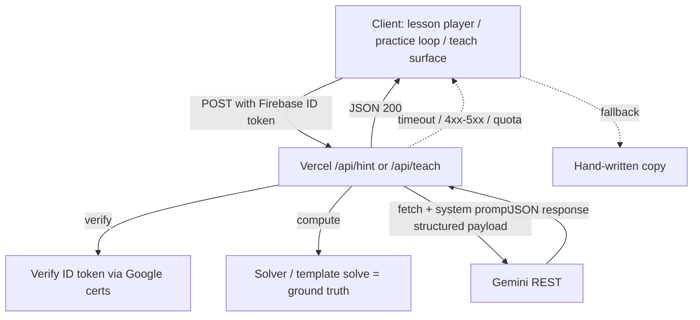

# Spec: AI Assist (Phase 2)

> New in Phase 2. Owns the **runtime** AI surfaces: the personalized hint / wrong-answer explanation (F2) and the stretch "teach the recruit" (F4). Track 1 practice generation does NOT live here — that's pure client-side code per [`spec-practice`](spec-practice.md) §"Phase 2 — Track 1 implementation specifics." The learner-model write path lives in [`spec-learner-model`](spec-learner-model.md). This spec is everything that ends in `fetch('https://generativelanguage.googleapis.com/...')`.
>
> Reopens [PRD §9.10 AC #1](../prd.md#910-scope--negative-criteria--10-acs) "no AI in MVP" — intentionally, for Phase 2 only. Preserves the spirit by keeping the **client bundle free of model SDKs** and the **API key off the client** entirely.

## Purpose

Two surfaces, one architecture:

- **F2 — Personalized hint / explanation.** When a learner is stuck (after 2 strikes in a lesson) or has just answered a practice problem wrong, generate a short nudge tuned to (a) the slot's structured state, (b) the learner's actual `answerPayload`, and (c) the learner's weak skills + recent misconceptions. For practice tries 1–2, the model is **not given the correct answer** and must not reveal formulas, substituted numbers, or worked steps. On the reveal turn, the canonical solution comes from the verified bank/template, not from model-only math.
- **F4 — Teach the recruit (stretch).** When a learner taps "Teach the recruit" on a concept they've finished, accept their free-text explanation, map it onto a **hand-authored rubric** for that concept (which key points they covered / missed / contradicted), flag any misconceptions, and reply in character as a naive novice asking one Socratic follow-up. The LLM is the _student_; the **transfer problem that follows is the test**.

## Non-negotiables

1. **No SDK in `package.json`, no API key in the client bundle.** Calls go to Gemini's REST endpoint via `fetch` from a Vercel serverless function. The key lives only as a Vercel env var. (Preserves PRD §9.10 AC #1's literal property: `git grep` over the shipped bundle stays clean.)
2. **No graded number from the model, ever.** Every graded answer comes from code or a verified bank/template. For early practice hints the model is not given the answer; on reveal turns it may see the verified answer only so it can phrase around bank truth.
3. **No PII in the request.** Server-side authentication uses the verified ID token's `uid` for rate limiting; the **request body** contains only structured slot data / template params / a learner-model summary. No name, no email, no `uid`, no free-typed personal information.
4. **AI-off must work end-to-end.** A single `VITE_AI_ENABLED=false` flag in the client returns the hand-written `feedbackByWrong*` / `explanation` / `explain()` for F2 and the rubric self-check for F4. The lesson player still completes.
5. **Structured output only.** Both endpoints request JSON with a strict schema. Parse failures fall back to authored copy.
6. **The model is never the judge.** F4 _maps_ free text onto a hand-authored rubric; correctness of the recruit's transfer attempt is decided by the template's `solve()`.

## Architecture



### Where it lives

- **Runtime:** Vercel serverless functions auto-detected from a root `/api` directory next to the Vite build (no Next.js, no framework migration). Two functions:
  - `api/hint.ts` — F2 (hint + explanation; same endpoint, mode flag in payload).
  - `api/teach.ts` — F4 (stretch).
- **Client adapter:** `src/features/lesson/aiHintService.ts` (used by both lesson player + practice loop) and `src/features/learner/teachService.ts` (stretch).
- **Flag:** `VITE_AI_ENABLED` (build-time, public). Defaults to `'false'`. The client never even attempts the fetch when off.
- **Key:** `GEMINI_API_KEY` (server-side only; **not** `VITE_`-prefixed). Set in Vercel project env vars.

### Why not Firebase AI Logic / on-client Gemini SDK?

The Firebase AI Logic skill in this workspace can call Gemini directly from the client (gated by App Check). Rejected for Phase 2 because:

1. It puts a model SDK in `package.json` / the bundle — breaks PRD §9.10 AC #1's literal property.
2. The solver-runs-first-then-grounds-the-prompt pattern is weaker on the client (we'd have to ship the solver and then trust the unmodified client to call it before the model).
3. Couples the AI runtime to the data backend; current architecture deliberately separates them (Firestore = data, Vercel = AI).

Documented as a rejected alternative in [`alternatives.md`](../alternatives.md) D93.

### Why not Firebase Cloud Functions (Blaze)?

Would require a Blaze plan, real billing, more infrastructure. Vercel serverless is already part of the deploy pipeline and has a generous free tier (Hobby: 1M invocations/mo). No second backend to manage. Documented in [`alternatives.md`](../alternatives.md) D92.

### Provider choice (Gemini)

- **Free tier with no credit card** (Google AI Studio): ~1,500 RPD / 10 RPM on Flash models — comfortably above demo / personal-launch traffic.
- **Acceptable tradeoff:** free-tier prompts may be used by Google to improve products. Since payloads carry only structured slot data + anonymized attempts (no name/email/uid), this is acceptable. Documented in [`alternatives.md`](../alternatives.md) D95 and the Brainlift.
- **Spend cap:** if billing is ever attached, a Project Spend Cap is set so cost cannot surprise. Realistic per-hint cost on Gemini Flash-Lite is ~$0.0001.
- **Provider portability:** the function isolates the prompt + REST call behind a `callModel({ system, payload })` helper, so swapping providers later is a one-file change.

## API contracts

### POST `/api/hint`

Used by lesson + practice for F2.

**Request (after token verification):**

```jsonc
{
  "mode": "hint" | "explanation",
  "context": {
    "kind": "lesson" | "practice",
    "lessonId": "long-run-frequency",    // if lesson
    "slotId": "the-puzzle",              // if lesson
    "templateId": "sum-of-two-dice",     // if practice
    "params": { "k": 7 },                // if practice
    "interactionKind": "multiple-choice"
  },
  "structuredSlot": {
    "prompt": "...",
    "context": "...",
    "options": [{ "id": "...", "label": "..." }],   // for MC
    "correctOptionId": "longrun",                    // for MC
    "feedbackByOption": { "biased": "...", "...": "..." }
  },
  "attempt": {
    "answerPayload": { "optionId": "biased" },     // exact shape from progressService.AttemptPayload
    "attemptNumber": 2,
    "wasCorrect": false
  },
  "verifiedAnswer": {
    "kind": "choice",
    "optionId": "longrun"
  },
  "learnerSummary": {
    "topWeakness": "long-run-vs-single-trial",
    "recentMisconception": "gambler"
  }
}
```

**Response (200):**

```jsonc
{
  "text": "Each flip is independent — the coin has no memory. Seven heads in ten flips is well within what a fair coin produces. What does '1/2' actually describe?",
  "modelVersion": "gemini-2.0-flash-lite",
  "promptMode": "hint"
}
```

**Response on failure** (network / quota / parse / non-200 from Gemini): the function returns `503` with `{ "fallback": true }`. The client treats _any_ non-200 the same way: render the authored copy already in the variant.

### POST `/api/teach` (stretch)

```jsonc
{
  "conceptId": "long-run-frequency",
  "rubric": [
    { "id": "single-trial-unpredictable", "summary": "A single trial is unpredictable" },
    { "id": "share-converges", "summary": "The long-run share converges to the true probability" },
    { "id": "many-trials-needed", "summary": "You need many trials before the share is sharp" },
    { "id": "not-promise-about-next", "summary": "P is not a promise about the next outcome" }
  ],
  "explanation": "...learner's free text...",
  "learnerSummary": {
    "topWeakness": "long-run-vs-single-trial",
    "recentMisconception": "gambler"
  }
}
```

**Response (200):**

```jsonc
{
  "coveredPoints": ["share-converges"],
  "missingPoints": ["single-trial-unpredictable", "not-promise-about-next"],
  "misconceptionFlags": [],
  "followUpQuestion": "Got it — so after 9 heads in a row, am I 'due' for tails next?"
}
```

The function validates the response against the schema (closed-set ids matching the supplied rubric; misconception keys from the closed enum). Anything else → fall back.

### Authentication

Both endpoints expect `Authorization: Bearer <firebase ID token>`. The function verifies it by fetching Google's public certs (or using `firebase-admin` if added later — but `jose` + a one-line JWT verify is enough and lighter). Unauthenticated → `401`. Token-uid is used **only** for per-uid rate-limiting (a small in-memory bucket per region; not perfect, fine for a personal launch).

### Rate limiting

Per-uid: at most 30 hint requests / 5 minutes. Per-IP fallback: 60 / 5 min. Exceeded → `429`, client falls back to authored copy (UI doesn't show an error, just the authored line).

## Prompt design

### Few-shot strategy (in-voice positives from lesson hints + explicit negatives) — refinement to layer on the baseline prompts

The lessons already contain **human-written, in-voice, no-reveal** hint copy (`feedbackByWrong*` + `explanation`, governed by D55's no-bail-out). Reuse a **curated** subset as few-shot exemplars so generated hints match the app's voice and never read as generic AI:

- **Positives (in-voice ground truth):** ~3–5 diverse lesson hints across interaction kinds / misconceptions. They are *style/voice* exemplars — label them "this is the shape of a good hint," so the model generalizes the style rather than copying the (different) content. They're already no-reveal, so they double as no-reveal examples.
- **Explicit negatives (contrastive):** for the same situation, pair a GOOD hint with a BAD one. Negatives to include: reveals the answer; chit-chat / "let's talk about something else" (no private convo); obeys an instruction-change / injection in the learner's text; generic praise/filler ("Great question!"); lectures / too long; does the work for them.
- **Curate, don't dump:** a small **pinned snapshot** (a tiny extract script can pull from the lessons), not all hints — token budget + clearer signal, and it won't drift as lessons change.
- **Cost:** the few-shot block is the *static* system prefix → OpenAI **prompt caching** makes it nearly free on repeat calls.
- **Verification carry-over:** because the exemplars are themselves no-reveal, they reinforce the hard no-reveal rule that the post-generation answer-leak filter still backstops.

(F2-A builds the baseline prompts; this is a follow-up enhancement to `api/_lib/prompts.ts` once it lands.)

### System prompt — hint mode

```
You are Pascal, a probability tutor for high-school learners.
You give SHORT (one to three sentences) Socratic nudges, not answers.
NEVER reveal or state the correct answer in hint mode.
NEVER lecture. Point at the specific misconception their answer reveals.
Respond as a JSON object {"text": "..."} with no other keys.
If you would otherwise output the answer, output {"text": "<a question that reframes the mistake>"}.
```

### System prompt — explanation mode

```
You are Pascal, a probability tutor for high-school learners.
The learner just answered wrong. The CORRECT ANSWER is provided in the payload.
Explain in 2-4 sentences WHY their specific answer was wrong, then state the
correct answer plainly. Tie the explanation to the misconception when one is named.
Respond as a JSON object {"text": "..."}. No other keys.
```

### System prompt — teach the recruit

```
You are a junior crew member ("the recruit"). You have just been taught a
probability concept by a fellow learner. Your job is NOT to grade them.
Instead:
  1. Read their explanation.
  2. For each rubric point provided, decide: COVERED, MISSING, or CONTRADICTED.
  3. Map any misconception to the supplied closed-enum keys.
  4. Ask ONE short, curious follow-up question about a missing point (if any).
You must respond as a JSON object matching this exact schema:
  { "coveredPoints": string[], "missingPoints": string[],
    "misconceptionFlags": string[], "followUpQuestion": string }
Use only rubric point IDs from the request. Use only misconception keys from
the request. If you would output anything not in this schema, return
{"coveredPoints":[],"missingPoints":[],"misconceptionFlags":[],"followUpQuestion":""}.
```

### Why these prompts work for this audience

- They are _short_ (working-memory respectful).
- They _forbid the LLM from being the judge_ (per the learning-science notes' explicit warning about LLMs over-praising free text).
- They _ground every response in structured state already in the payload_ (rubric ids, misconception keys).
- They _refuse_ when off-schema, with a safe-default JSON, instead of free-rambling.

## Fallback strategy (AI-off path)

| Surface | AI-on | AI-off / failure |
| --- | --- | --- |
| F2 hint (lesson) | Gemini-generated 1–3 sentence nudge | The variant's `feedbackByWrong*` for the matched key, else `feedbackDefault`. After 2 strikes, `explanation` appears beneath. **This is the existing Phase 1 behavior.** |
| F2 explanation (practice) | Gemini-generated tuned explanation alongside `explain()` | `explain()` (the worked solution from the template) alone — unchanged from the rest of the practice loop. |
| F4 teach the recruit | Structured rubric mapping + follow-up | A static "did your explanation cover these?" rubric self-check panel. The transfer problem still works (it's just a normal practice problem). |
| Session recap (stretch F5) | Gemini-summarized session | Static "you solved N problems; your strongest skill today was X" template. |

The flag flip is at-runtime, not build-time: when `VITE_AI_ENABLED` becomes `false`, the client adapter short-circuits without touching the network on the very next render. (No reload needed.)

## Security model

- **API key.** Server-side env var only. Never reaches the client.
- **Token verification.** Required on every call.
- **Payload validation.** Both endpoints validate the request body against a JSON schema before calling the model; reject malformed requests with `400`.
- **Response validation.** Model output is JSON-parsed and validated against the response schema; failures fall back.
- **Prompt-injection containment.** Learner free text (F4 only) is wrapped in clearly delimited markers in the prompt (e.g. `<<<learner text>>>`); the system prompt instructs the model to treat content inside the markers as data, not instructions. The function ignores any response field outside the documented schema.
- **No echo.** The function never echoes or logs the learner's `answerPayload` or `explanation` in a way that would expose it across requests (no persistent logs of payload content; only structural metadata for rate-limit + error monitoring).
- **Replay safety.** A repeat request is idempotent — the model output is not stored anywhere except returned to the client.

## Observability

- **Structured logs (no payload content):** request count, latency, model version, parse-fail rate, rate-limit hits.
- **Sentry breadcrumbs (client):** "ai-hint:requested", "ai-hint:fallback-rendered", "ai-hint:200" — no payload.
- **Dashboards:** Vercel function metrics + Gemini AI Studio's rate-limit dashboard.

## Refinement (2026-06-25): the chosen F2 build — free-response, 3-try hint ladder, two-part conceptual

> Supersedes the F2 sketch in §Purpose with the concrete, owner-chosen build. **Provider note:** F2 now targets **OpenAI (GPT-5.x)** via the same pattern — server-side key, no model SDK in the client bundle, `fetch` from the function (swap the `callModel` helper). The Non-negotiables still hold; "the served answer comes from code, never the model" is unchanged. (D93 fetch-not-SDK still applies; D95's Gemini-free-tier rationale is superseded by the OpenAI key — reconcile in a follow-up D-entry.)

### Two answer modes — both free-response, both code-anchored

1. **Computational → numeric fill-in.** The learner types the answer (fraction or integer); `solve()`/`checkAnswer` grades it exactly (equivalent forms accepted). No multiple choice. Converting the existing MC families to numeric fill also **deletes the I-WP-H int/choice hack** (counts become a typed integer).
2. **Conceptual → two-part: answer + why.** Part 1 is a **concrete, code-verified** answer (e.g. "P(next flip is tails) = ___" → 1/2). Part 2 is a **free-response "why"** judged against a hand-authored rubric. The two-part shape is what makes conceptual problems rigorous: part 1 is a verifiable anchor, and the model judges part 2 *knowing whether part 1 was right* and against the rubric — never in a vacuum.
   - **High-value diagnostic unlocked — right answer, wrong reasoning.** A learner can answer "1/2" (correct) but justify it with "the coin is due for tails" (gambler's fallacy). Numeric-only grading marks it correct and misses the misconception; the answer+why form catches it ("right number, but that reasoning is the gambler's fallacy"). This is the feedback that actually moves learning.

### 3-try hint ladder + reveal (the practice wrong-answer loop)

- Wrong try 1 → small grounded nudge. Wrong try 2 → bigger nudge / point at the method. Wrong try 3 → **reveal the canonical solution loaded from the bank** (always correct), then advance.
- The model is instructed to **never reveal the answer** in the hint turns; only the try-3 reveal shows it, and that comes from the **bank, not the model**.
- Bounds frustration (the >50%-failure-demotivates lever) and cost (≤3 model calls/problem).

### Grounding & verification posture (honest)

- **Computational:** code-verified end to end. Guarantee airtight.
- **Conceptual part 1 (answer):** code-verified. **Part 2 (why):** model-judged, but *anchored* by (a) part-1 correctness, (b) rubric key-points, (c) enumerated misconceptions — it **classifies against a fixed bank, it does not judge open-endedly**. Formative, not a grade. The **revealed answer always comes from the bank** (verified content), so what the learner ultimately sees is correct even though the in-loop reasoning judgment is model-based.
- Reuses the **F4 rubric mechanism (D96)** — same "LLM maps free text onto a fixed rubric, never an open judge" pattern. F2-conceptual and F4 share one engine.

### Guardrails

- Irrelevant / gaming FRQ → generic "not quite — try again," never rewarded.
- The learner's free text is passed as **data, not instructions** (delimited markers; prompt-injection containment); model output is validated against the response schema before use.
- **AI-off fallback:** computational shows the worked solution; conceptual shows the rubric key-points as a self-check + the bank answer.

### Content shape needed (new)

A conceptual problem carries `{ answer (code-checkable), rubric: keyPoints[], misconceptions: MisconceptionKey[], canonicalWhy }` — the "bank" the model is grounded on and the reveal is drawn from. Authorable; probability's conceptual misconceptions (gambler's fallacy, equiprobability bias, base-rate neglect, …) are well known and already in the taxonomy.

### XP policy (CONFIRMED)

Per-try decay on the difficulty-scaled award `X` (= `xpForDifficulty(elo)`): **try 1 correct → full `X`; try 2 → `round(X/2)`; try 3 → `round(X/4)` (floor 1 while > 0); revealed after 3 wrong → 0.** Daily cap (`PRACTICE_DAILY_XP_CAP`) unchanged. For conceptual problems, **"nailed" = correct answer AND sound reasoning** (the stronger mastery signal); a correct answer with a flagged misconception still advances and awards the try-based XP, but is marked for review. _(Confirmed 2026-06-25; encode as pure logic alongside `grantPracticeXp` in `practiceXp.ts`.)_

### Collision note

The `/api` function + client adapter are new/safe files. The **free-response conversion, the 3-try loop, and the two-part conceptual UI live in `PracticeSession` + the template/content files the practice-redesign agent currently owns** — coordinate or hand off; do not edit concurrently.

### Acceptance criteria (refinement)

1. All practice problems are free-response: computational = numeric fill-in (code-graded); conceptual = answer (code-graded) + "why" (rubric-judged).
2. A wrong answer triggers a grounded hint that never reveals the answer; after 3 wrong tries the canonical solution (from the bank) is shown.
3. The "why" judgment classifies against the rubric + known misconceptions (not open-ended), with part-1 correctness in context; **right-answer-wrong-reasoning is detected and surfaced.**
4. Irrelevant FRQ → generic try-again; FRQ text treated as data (injection-contained); output schema-validated.
5. Computational answers and conceptual part-1 answers are code-verified; the revealed solution is bank content; the model never emits the graded answer.
6. AI-off fallback works (worked solution / rubric self-check).

## Acceptance criteria

1. **No SDK in package.json.** `npm ls` shows no `@google/generative-ai` (or equivalent) dependency.
2. **No key in the client bundle.** `grep` of the built `dist/` shows no `GEMINI_API_KEY` value or `VITE_GEMINI*` variable.
3. **Authentication required.** Unauthenticated calls to `/api/hint` and `/api/teach` return `401`.
4. **Solver runs first.** The function computes `solve()` (or pulls the slot's `correctOptionId`) **before** the Gemini call, and includes it in the prompt as ground truth.
5. **Hint never reveals the answer.** Spot-checked manually and by an adversarial test that asks for the answer; the system prompt refuses by design (and parser falls back if the model leaks it).
6. **AI-off works end-to-end.** With `VITE_AI_ENABLED=false`, a learner can complete a full lesson and a 10-problem practice session with only authored copy. Demoable by toggling the env var.
7. **Structured output enforced.** Both endpoints reject and fall back on any response that doesn't parse to the documented schema.
8. **Rate-limit safe.** A 429 response on the client triggers fallback (not an error toast). Verified by spamming the endpoint.
9. **Privacy posture.** Request bodies contain no name, email, or `uid`; uid is attached from token server-side for rate limiting and not echoed in any log line.
10. **Documented decisions.** D92–D97 in [`alternatives.md`](../alternatives.md) cover: Vercel-over-Cloud-Functions, Vercel-over-Firebase-AI-Logic, fetch-not-SDK, Gemini free tier, LLM-not-judge, no RAG.

## Edge cases

| # | Case | Handling |
| --- | --- | --- |
| AI-E1 | Gemini quota / 429 | Function returns 503 `{ fallback: true }`; client renders authored copy. |
| AI-E2 | Network drop mid-request | `fetch` rejects → same fallback path. |
| AI-E3 | Model returns malformed JSON | Parse fails → fallback. |
| AI-E4 | Model attempts to reveal the answer in hint mode | System prompt instructs refusal; parser drops responses containing recognizable patterns ("The correct answer is...") in hint mode and falls back. |
| AI-E5 | Learner free text contains a prompt-injection attempt (F4) | Delimited markers + system-prompt instruction to treat content as data; response schema validation rejects off-schema output. |
| AI-E6 | Verified token expired mid-session | Function returns 401; client re-fetches the token and retries once, then falls back. |
| AI-E7 | `aiEnabled` flag flipped at runtime | Client adapter checks per-call; next render uses the new value without reload. |
| AI-E8 | Model output is offensive / age-inappropriate | Gemini's safety filters block; on filter-block we fall back. (Phase 3: add a profanity post-filter.) |
| AI-E9 | Two devices, same uid, simultaneous bursts | In-memory rate limit is per-region; one device may see 429 first → fallback. Acceptable. |
| AI-E10 | The verified answer is genuinely ambiguous (e.g. equivalent fractions) | The solver normalizes (reduce to lowest terms); the variant's correctness check already handles equivalent forms (Phase 1 §9.4 #3). |

## Out of scope

- **Streaming responses.** Single-shot JSON only for v1; streaming buys little for a 1–3 sentence hint and complicates the JSON-schema validation.
- **Multi-turn chat.** F4 is a single turn: explanation → JSON response → transfer problem. No back-and-forth conversation.
- **Image / multimodal inputs.** Text-only.
- **Model-graded free-text response anywhere else.** Phase 3 only, and only with strong human-in-the-loop guardrails.
- **Persistent storage of prompts or responses.** No prompt/response log in Firestore.
- **In-app model swap.** Provider is locked to Gemini in v1; swap requires a function re-deploy.

## Open questions

- **Rate limit values** (30/5min per uid, 60/5min per IP) are first-cut; tune after launch.
- **Misconception detection from F4** — should the model output be allowed to invent a key, or strictly closed-set? Spec says strictly closed-set. Risk: misses novel misconceptions until we add a key.
- **Spend cap** (if billing ever attached) — start at $5/mo.
- **Whether to ship a server-side "explanation cache"** for enumerable distractors (F2 explanation mode on multiple-choice variants) — pre-generate offline, look up at runtime. Out of v1 scope; logged for v2 cost/latency wins.
