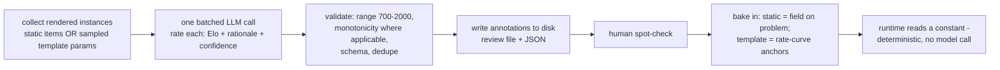

# Spec: AI Difficulty Annotation (offline)

> Use an LLM to **estimate the difficulty** of practice problems, offline and in batch, and bake the result in as a plain number. The runtime stays deterministic and verifiable; the model only supplies a difficulty *estimate*, never a served answer. Lives in `scripts/` alongside the curriculum-harvest tooling. Status: **planned** (not yet implemented).
>
> Companion: [`spec-practice`](spec-practice.md) (the Elo scale + adaptive serving this feeds), [`spec-ai-assist`](spec-ai-assist.md) (the "AI is offline + verified, never a served answer" posture), [`spec-curriculum-harvest`](spec-curriculum-harvest.md) (the offline problem pipeline this slots into).

## Purpose

Today every problem's difficulty comes from a **hand-written `rate(params)` formula** per template (e.g. `sum-of-two-dice` rates rarer sums harder). That's deterministic and testable, but it's an author's guess and it doesn't scale as the problem bank grows. We want an LLM to produce difficulty estimates across many problems at once — cheaply, consistently, and without ever putting a model in the runtime answer path.

## The key principle (why AI is allowed here, unlike answers)

Difficulty is an **estimate**, not a **correctness claim**. The whole app forbids an LLM from emitting a *served answer* (answers are computable and must come from `solve()`). Difficulty is different: there is no single "true" difficulty to verify against — it's an empirical/subjective quantity. So an LLM is a legitimate *estimator* for it, provided:

1. **It runs offline (build-time), never at request time.** The annotation is written back as a constant; the runtime reads a number, so serving stays deterministic and reproducible.
2. **It is bounded + sanity-checked** by the same guardrails the hand-written formulas already pass (Elo range `[700, 2000]`, monotonicity where a clear ordering exists) plus a human spot-check.
3. **It is treated as a prior, not gospel** — to be refined by real attempt data once there are enough users (see "Out of scope / future").

## Design choice (CHOSEN)

**Offline batch annotation of rendered problem instances.** The unit of annotation is a **concrete rendered problem** (a fully-specified instance — "two dice, P(sum = 2)"), not a template formula. One offline script collects a set of rendered instances, sends them to the LLM **in a single batched call**, gets back a difficulty Elo per instance with a short rationale + confidence, validates them, and writes the results to disk for review and use.

Two application modes, same mechanism:

- **Static / generated problem bank** (the curriculum-harvest `generated-problems/` items, Track 2): annotate **each fixed problem** directly. This is the literal "throw them all in one call" case — every item gets its own difficulty number stored on the problem record.
- **Parameterized templates** (Track 1, live today): difficulty varies by params, so you can't put one number on a template. Instead, **sample a handful of instances per template** (e.g. 6-10 param sets spanning the space), annotate those, and use them to **anchor/replace the template's `rate(params)`** (fit a simple monotone curve through the LLM-rated anchors, or set per-bucket constants). The template still computes a deterministic number at runtime; the LLM just informed the curve.

Why instances rather than formulas: the LLM rates a *concrete problem* far more reliably than it critiques an abstract scoring function, and instance ratings transfer directly to the static bank. It also keeps a single annotation format across Track 1 and Track 2.

## Workflow



- **Where:** `scripts/practice/annotate-difficulty.ts` (Node, offline) — same posture as the curriculum-harvest scripts; **not shipped in the client bundle**, no runtime model call, API key only in the script's env.
- **Input:** a list of rendered instances. For Track 1, generated by `sample()` over a fixed seed so the annotated set is reproducible. For Track 2, the bank items.
- **Output:** a review markdown + a JSON file under `docs/curriculum-harvest/generated-problems/` (or a sibling `difficulty-annotations/` dir), mirroring the existing review-artifact convention. Nothing is auto-applied to source — a human promotes it.

## Annotation schema

```ts
type DifficultyAnnotation = {
  /** Stable id: static problemId, or `${templateId}:${paramsHash}` for sampled instances. */
  id: string;
  templateId?: string;          // present for Track-1 sampled instances
  promptText: string;            // the rendered problem the model rated (for review)
  difficultyElo: number;         // 700–2000, the estimate
  confidence: 'low' | 'medium' | 'high';
  rationale: string;             // one sentence — why this difficulty (for human review)
};
```

## Prompt design (offline)

System prompt, roughly:

```
You are a math-education difficulty rater for high-school probability problems.
Rate each problem's difficulty on an Elo-like scale from 700 (a confident
beginner solves it) to 2000 (genuinely hard for a strong student). Judge the
COGNITIVE difficulty for a high-schooler — number of steps, abstraction, common
traps — NOT how rare the answer is. Be internally consistent: a problem that is
clearly harder than another must get a higher number. Return STRICT JSON: an
array of { id, difficultyElo, confidence, rationale } and nothing else.
```

The batch payload is the array of `{ id, promptText }`. Asking for relative consistency in one call (rather than one-problem-per-call) is the point: the model anchors the whole set against itself, which is exactly what an Elo scale needs.

## Verification & guardrails

The model output is **never trusted blind**:

1. **Schema + range validation** — reject any item outside `[700, 2000]` or off-schema; re-request or fall back to the hand-written `rate()` for that item.
2. **Monotonicity sanity** — for families with a clear difficulty ordering (e.g. `k-heads-in-n` should be non-decreasing in `n`), assert the LLM ratings respect it; flag violations for human review rather than auto-applying.
3. **Human spot-check** — a person reviews the generated markdown before promotion (same gate as generated problems).
4. **Existing tests stay** — the template `rate()` monotonicity + range unit tests remain the runtime contract; LLM anchors must keep them green.

## Out of scope / future

- **Data calibration (deferred — needs users).** The principled long-term answer is to adjust each problem's Elo from **observed learner success rates** (IRT / Elo-of-the-item). We don't have enough users yet, so this is future work. When it lands, the **LLM annotation becomes the cold-start prior** and attempt data is the posterior — they compose, they don't compete.
- **Runtime LLM difficulty calls** — rejected (see alternatives).
- **Re-annotating on every content change automatically** — manual, human-gated for now.

## Open questions

- **Anchor count per template** (how many sampled instances to rate per Track-1 family) — start ~8; tune.
- **How to fit `rate()` from anchors** — simplest is per-difficulty-bucket constants or a monotone linear fit through the anchors; revisit if it's too coarse.
- **Annotation storage location** — reuse `docs/curriculum-harvest/` review convention vs a dedicated `difficulty-annotations/` dir (coordinate with the curriculum-harvest workstream, which owns that tree).

---

## Design decision + alternatives (the record you asked for)

**Decision (DA1): Offline batch annotation of rendered instances; baked in as a constant; LLM as estimator only.**

- **Chose:** an offline `scripts/` batch that rates concrete rendered problems in one call, validates + human-reviews, and writes a difficulty Elo back as a constant the deterministic runtime reads. Difficulty is treated as an LLM-estimated prior (calibration later).
- **Considered:**
  - **(A) LLM critiques/writes the `rate(params)` formula** (annotate at the template/formula level, not instances). *Rejected as the primary path:* models rate concrete problems far more reliably than they reason about an abstract scoring function, and formula-level output doesn't transfer to a static bank. Kept as an option for quick "does this family's ordering look sane?" reviews.
  - **(B) Runtime LLM difficulty call** (rate the problem when it's served). *Rejected:* non-deterministic serving, per-request latency/cost, a model in the hot path, and it breaks the "no live model in the runtime" property the rest of the app holds. Offline + baked is strictly better.
  - **(C) Data calibration first (IRT/Elo from attempt data).** *Deferred, not rejected:* it's the most principled approach but **requires a user base we don't have yet**. It becomes the refinement layer on top of the LLM prior once usage grows (future work).
  - **(D) Keep hand-written `rate()` only (status quo).** *Rejected for scale:* fine for six families, doesn't scale as the harvested bank grows; authors' guesses drift in consistency across many problems. The LLM gives consistent cross-problem anchoring in one pass.
  - **(E) LLM difficulty as runtime source of truth with no validation.** *Rejected:* unverified model output driving serving + XP is exactly the failure mode the app's correctness posture forbids; we gate with range/monotonicity + human review.
- **Gaps / risks:**
  - LLM difficulty ratings can be miscalibrated or inconsistent across batches; mitigated by single-batch relative rating + monotonicity guardrails + human spot-check.
  - Until data calibration exists, difficulty is "best estimate," so adaptive serving may occasionally mis-target; acceptable at current scale and self-corrects once calibration lands.
  - Annotation lives in the offline pipeline currently owned by the curriculum-harvest workstream — implementation must be coordinated with that owner to avoid editing the same files concurrently.
