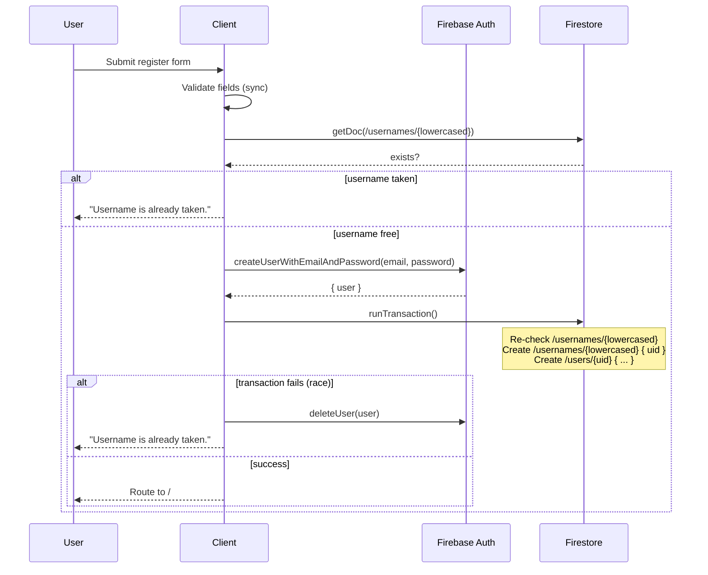

# Spec: Auth

> Owns sign-up, sign-in, sign-out, and the in-app representation of the current user. Backed by Firebase Auth (email/password) + a `/users/{uid}` Firestore profile doc and `/usernames/{lowercased}` sentinel for case-insensitive uniqueness.

## Purpose

Let a learner create an account with email + username + password, log in (with email _or_ username), and log out. Make the current user and profile available app-wide via `useAuth()`. Establish the user's `/users/{uid}` profile doc so other features (progress, habit loop, profile screen) have somewhere to write to.

## User-facing behavior

### Registration (`/register`)

- Fields: email, username, password, confirm password. Single "Create Account" button.
- Inline validation:
  - Email: standard format check.
  - Username: 3–20 chars, `[a-zA-Z0-9_]+` only.
  - Password: minimum 6 characters.
  - Password + confirm must match.
- On submit:
  - If `/usernames/{lowercasedUsername}` already exists → inline error "Username is already taken."
  - If Firebase Auth email is in use → inline error "An account with this email already exists."
  - On success: user is auto-signed-in and routed to `/`.
- New users land with `currentStreak: 0`, `xp: 0`, no avatar.

### Login (`/login`)

- Fields: email-or-username, password. Single "Sign In" button.
- On submit:
  - If input looks like email (contains `@`) → call `signInWithEmailAndPassword(email, password)` directly.
  - Otherwise → read `/usernames/{lowercased input}` → fetch `/users/{uid}.email` → call `signInWithEmailAndPassword(email, password)`.
  - Generic failure message on any auth failure: "Email/username or password is incorrect." (Do not reveal which.)
- On success: route to `/`.

### Sign out

- Triggered from Profile (see `spec-profile`). Calls `signOut()`, redirects to `/login`.

### Session

- Firebase Auth persists sessions across reloads via IndexedDB by default. No "Remember me" toggle.
- Routes are gated by `<RequireAuth>` (see `docs/architecture.md` §5). Unsigned users hitting a gated route are redirected to `/login`.

## Data model

### Firestore docs this spec owns

| Path                              | Created when | Mutated when                                                                  |
| --------------------------------- | ------------ | ----------------------------------------------------------------------------- |
| `/users/{uid}`                    | Registration | Profile edits (see `spec-profile`), XP/streak updates (see `spec-habit-loop`) |
| `/usernames/{lowercasedUsername}` | Registration | Never (no rename in MVP)                                                      |

### `/users/{uid}` shape (full schema)

| field               | type           | default             | notes                            |
| ------------------- | -------------- | ------------------- | -------------------------------- |
| `username`          | string         | required            | lowercased form, used for lookup |
| `displayUsername`   | string         | required            | preserves user's chosen casing   |
| `email`             | string         | required            | mirrored from Firebase Auth      |
| `bio`               | string         | `''`                |                                  |
| `avatarUrl`         | string \| null | `null`              |                                  |
| `xp`                | number         | `0`                 |                                  |
| `lessonsCompleted`  | number         | `0`                 |                                  |
| `stepsCompleted`    | number         | `0`                 |                                  |
| `currentStreak`     | number         | `0`                 |                                  |
| `bestStreak`        | number         | `0`                 |                                  |
| `lastActiveDate`    | string \| null | `null`              | `YYYY-MM-DD`                     |
| `milestonesReached` | string[]       | `[]`                |                                  |
| `createdAt`         | Timestamp      | `serverTimestamp()` |                                  |

### `/usernames/{lowercasedUsername}` shape

| field       | type      | notes                 |
| ----------- | --------- | --------------------- |
| `uid`       | string    | the owning user's UID |
| `createdAt` | Timestamp | `serverTimestamp()`   |

### Registration transaction

Username uniqueness has no native Firestore constraint, so registration runs as a sequence with rollback on failure:



The pre-transaction `getDoc` is a UX optimization (catches most collisions without burning an auth account). The transaction is the authoritative check.

### Firestore security rules (this spec's slice)

```
match /users/{uid} {
  allow read: if request.auth != null;
  allow create: if request.auth.uid == uid
                && request.resource.data.xp == 0
                && request.resource.data.currentStreak == 0;
  allow update: if request.auth.uid == uid;
  allow delete: if false;
}

match /usernames/{name} {
  allow read: if true;
  allow create: if request.auth != null
                && request.resource.data.uid == request.auth.uid
                && name == name.lower();
  allow update, delete: if false;
}
```

Other features extend the rules for their own subcollections (see those specs).

## Implementation outline

1. Create `src/lib/firebase.ts` exporting `app`, `auth`, `db`, `storage`; reads `VITE_FIREBASE_*` envs; wires up emulator connections when `VITE_USE_EMULATOR === 'true'`.
2. Create `src/features/auth/userService.ts` with `registerUser({email, username, password})`, `signIn({identifier, password})`, `signOutUser()` — each returns `Promise<{ok: true} | {ok: false, error: AuthError}>` with a discriminated union of `AuthError` codes.
3. Create `src/features/auth/AuthProvider.tsx` exposing `<AuthProvider>` and `useAuth()`; subscribes to `onAuthStateChanged` and `onSnapshot(/users/{uid})`; returns `{ user, profile, loading }`.
4. Create `src/features/auth/RequireAuth.tsx` — a component that renders children when `user` exists, else `<Navigate to="/login" replace />`.
5. Create `src/features/auth/RegisterPage.tsx` with shadcn `Card`/`Input`/`Label`/`Button` form, calls `registerUser`, displays inline errors.
6. Create `src/features/auth/LoginPage.tsx` with shadcn form, calls `signIn`, displays generic error on failure.
7. Wire `<AuthProvider>` and routes in `src/App.tsx`; gate `/`, `/lesson/:id`, `/profile` with `<RequireAuth>`.
8. Write `firebase/firestore.rules` with the rules above (and stubs for the other subcollections, filled in by other specs).
9. Add `firebase/firestore.indexes.json` (empty for MVP — no composite queries needed yet).
10. Write Vitest tests for `userService.ts` using the Firebase emulator: register-and-login round trip, duplicate username rejection, login by username, login by email, sign out.

## Edge cases

- **Registration race condition:** two users submit the same username simultaneously. Both pass the pre-check; the transaction's re-check + sentinel `create` (which fails if doc exists) catches the second; the auth account gets rolled back via `deleteUser`.
- **Orphan auth user:** `createUserWithEmailAndPassword` succeeds but the Firestore transaction crashes (network drop). The catch block calls `deleteUser` to clean up. If `deleteUser` _also_ fails, log to Sentry; the user can re-try registration only after recovering the email (acceptable corner case for MVP).
- **Login by username when sentinel doc exists but user doc doesn't:** treat as "Email/username or password is incorrect" — same generic error.
- **User changes their Firebase Auth email outside the app:** the mirrored `email` in `/users/{uid}` becomes stale; login-by-username breaks until they re-register. Out of scope for MVP.
- **Username with mixed casing:** `Pascal`, `PASCAL`, `pascal` all map to the same sentinel `/usernames/pascal`. Stored `displayUsername` preserves casing for UI.
- **Forgot password:** out of scope for MVP. (Firebase Auth supports it natively; flag for Phase 2.)
- **Email verification:** not enforced in MVP; users can sign in immediately after registering.

## Test plan

- Register-and-login round trip works against the emulator.
- Registering with a taken username returns the "taken" error and does not leave an orphan auth user (verified by checking emulator's auth user list before and after).
- Login by username dispatches to the right account; login by email dispatches to the right account; login with wrong password returns the generic error.
- Security rules: an authed user can read another's `/users/{otherUid}` (we allow because login-by-username needs it) but cannot write to it.
- Security rules: an unauthed user cannot read `/users/*` but can read `/usernames/*` (for the registration check).
- Sign out clears `useAuth().user` and redirects to `/login`.
- Routing: hitting `/profile` while signed out redirects to `/login`.

## Out of scope

- Google / Apple / social sign-in (alternatives D17).
- Forgot password / email verification (Phase 2).
- Multi-factor auth (Phase 3).
- Account deletion (Phase 3 / GDPR compliance).
- ~~Username change after registration~~ — **shipped 2026-06-24**: renames release + re-reserve the sentinel in one transaction (D16 amendment).
- Email change (out of MVP; Firebase Auth supports it but our mirrored `email` would need sync).
