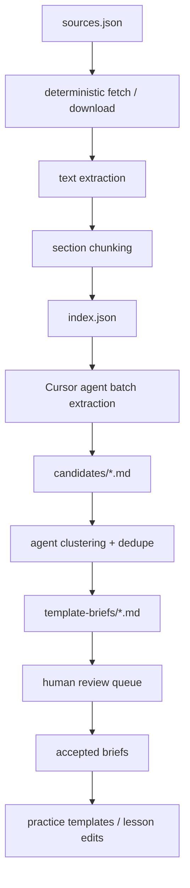

# Spec: Agent-Run Curriculum Harvest

> Offline pipeline for finding strong open probability problems, extracting the
> underlying pedagogical ideas, and turning them into Pascal-native lesson or
> practice-template briefs. This is designed for speed when the owner has **no
> external model API access**: deterministic scripts prepare local files; Cursor
> agents do the LLM work inside the IDE; humans verify at fixed review gates.

---

## Purpose

Pascal needs more probability coverage than the current hand-authored sampler can
provide quickly. The goal is to mine human-vetted open educational resources for:

- problem families worth implementing,
- tricks and solution moves students should learn,
- common misconception traps,
- parameter ranges that make good adaptive practice,
- references that prove the curriculum is comprehensive.

The goal is **not** to scrape a copied problem bank. The safe path is:

1. Use open sources to discover problem families and pedagogical moves.
2. Rewrite everything into Pascal's voice and interaction model.
3. Serve only problems whose answers are computed by Pascal code (`solve()`), per
   [`spec-practice`](spec-practice.md).
4. Human-review every batch before it becomes lesson content or practice code.

## Non-negotiables

1. **No external LLM API required.** The pipeline must run from this repo and the
   Cursor agent session. Scripts may fetch, parse, chunk, index, and validate, but
   they do not call Gemini/OpenAI/Anthropic APIs.
2. **No restricted scraping.** Do not bypass login walls, paywalls, robots-like
   restrictions, or source terms. Sources with unclear rights are marked
   `permission-needed` or `inspiration-only`.
3. **No "change the numbers" laundering.** A lightly modified textbook exercise is
   still a derivative. Direct adaptation is allowed only when the source license
   and attribution plan support it.
4. **Every generated artifact carries provenance.** Candidate ideas, template
   briefs, and accepted templates all track source ids and reuse mode.
5. **Human review gates are mandatory.** Agents can triage, cluster, and draft.
   Humans approve source status, candidate value, legal posture, and final build
   priority.
6. **Final answers come from code.** Harvested ideas become template briefs first;
   shipped practice families still need deterministic `solve()` + simulation or
   exact-enumeration tests.

## Architecture



### What Scripts Do

Scripts are deterministic and repeatable:

- read the source registry,
- download approved public PDFs / HTML pages,
- extract text,
- split text into local chunks,
- compute hashes so chunks are stable,
- generate an index of unprocessed chunks,
- validate that every candidate/brief has required metadata.

Scripts do **not** decide pedagogy, rewrite problems, or call a model.

### What Cursor Agents Do

Agents process local chunks and write structured docs:

- extract problem-family ideas,
- tag skills and misconceptions,
- summarize the core trick,
- flag legal/reuse concerns,
- cluster duplicate ideas,
- draft Pascal-native template briefs,
- update the human review queue.

This can be one parent agent for small batches, or multiple subagents for speed.

### What Humans Do

Humans approve at three fixed gates:

- **Gate A — Source approval:** license/reuse mode is acceptable.
- **Gate B — Candidate approval:** the idea is worth keeping.
- **Gate C — Build approval:** the template brief is safe, useful, and ready for
  TypeScript implementation.

## File Layout

```text
docs/curriculum-harvest/
  README.md
  sources.json
  index.json
  raw/
    <source-id>.txt
  chunks/
    <source-id>/
      chunk-0001.md
      chunk-0002.md
  candidates/
    batch-0001.md
  clusters/
    cluster-map.md
  template-briefs/
    batch-0001.md
  review-queue.md
  accepted/
    practice-template-briefs.md
    lesson-ideas.md

scripts/curriculum-harvest/
  ingest.ts
  chunk.ts
  validate.ts
```

Keep raw/chunked text out of the app bundle. These are research artifacts only.
If raw PDFs/text are large or license-sensitive, prefer `.gitignore` for
`raw/` and `chunks/`, while committing `sources.json`, indexes, candidates,
briefs, and review decisions.

## Source Registry Contract

`docs/curriculum-harvest/sources.json` is the human-approved input. Each source:

```json
{
  "id": "openintro-ahss",
  "title": "OpenIntro Advanced High School Statistics",
  "url": "https://www.openintro.org/book/ahss/",
  "retrieval": {
    "kind": "manual-download",
    "path": "docs/curriculum-harvest/raw/openintro-ahss.txt"
  },
  "license": {
    "name": "CC BY-SA 3.0",
    "url": "https://creativecommons.org/licenses/by-sa/3.0/",
    "commercialOk": true,
    "shareAlike": true,
    "requiresAttribution": true
  },
  "reuseMode": "adapt-ok-with-attribution",
  "status": "approved",
  "targetTopics": ["sample-space", "conditional", "expected-value"],
  "notes": "Do not use OpenIntro branding or title for derivatives."
}
```

Allowed `reuseMode` values:

- `copy-ok` — direct excerpts are permitted with attribution. Rare; still avoid
  unless it improves the learner experience.
- `adapt-ok-with-attribution` — derivative use is allowed under the license.
- `inspiration-only` — do not copy wording, numbers, unique scenario, or solution
  text. Extract the abstract move only.
- `permission-needed` — do not process beyond source notes until permission is
  granted.
- `blocked` — do not ingest.

Initial source priorities:

| Source | Default reuse mode | Why |
| --- | --- | --- |
| OpenIntro Advanced High School Statistics | `adapt-ok-with-attribution` | Best high-school fit; strong probability chapter. |
| OpenIntro Statistics | `adapt-ok-with-attribution` | Rich exercise set and probability chapter. |
| OpenStax Introductory Statistics, original CC BY edition | `adapt-ok-with-attribution` | Flexible license; good tables, trees, conditional probability. |
| Illustrative Mathematics first edition | `adapt-ok-with-attribution` | Human-vetted HS tasks; useful activity structures. |
| Grinstead-Snell | `adapt-ok-with-attribution` | Deep classic bank; strongest for tricks and expected value. |
| CK-12 | `inspiration-only` until checked | High-school level, but current license is CK-12-specific. |
| MIT OCW | `inspiration-only` or `adapt-ok-with-attribution` only for noncommercial paths | Good enrichment; many resources are CC BY-NC-SA. |
| Khan / AoPS / Alcumus / contests | `inspiration-only` or `blocked` | Valuable for style, unsafe for copying without permission. |

## Candidate Schema

Agents write candidate ideas in Markdown, one block per candidate:

```md
### CAND-0001 — At least one via complement

- **Source ids:** openintro-ahss §3.1, openstax-intro-stats §3
- **Reuse mode:** inspiration-only
- **Roadmap target:** Unit 5 — Probabilities of multiple events
- **Practice topic:** complement
- **Skills:** complement-rule, independence
- **Misconceptions:** counts-directly-when-complement-is-easier, independence-confusion
- **Core trick:** Compute "none happen" first, then subtract from 1.
- **Why it matters:** This is the fastest path for "at least one" questions and
  supports birthday paradox later.
- **Template sketch:** n independent trials, event probability p, ask P(at least
  one success). Answer is 1 - (1 - p)^n.
- **Interaction fit:** fill-fraction or multiple-choice.
- **Solver feasibility:** exact Fraction over small integer p.
- **Legal notes:** No wording copied; scenario should be newly authored.
- **Human status:** pending
```

## Template-Brief Schema

Approved candidates become Pascal template briefs:

```md
### TEMPLATE-BRIEF — at-least-one-via-complement

- **Build target:** `src/features/practice/templates/at-least-one-via-complement.ts`
- **Topic:** complement
- **Skills:** complement-rule, independence
- **Retrieval form:** procedural
- **Difficulty range:** 900-1300
- **Learner goal:** See that "at least one" is often easier through "zero."
- **Params:** `n: 2..8`, `pNum/pDen` from friendly fractions.
- **Render shape:** Ask for P(at least one success) in a short concrete scenario.
- **Solve:** `1 - ((den - num) / den)^n`, reduced.
- **Simulate:** Run n Bernoulli trials per experiment; count at least one success.
- **Distractors:** multiply n*p, compute exactly one, forget complement.
- **Worked solution outline:** name opposite event -> compute none -> subtract from 1.
- **Source inspiration:** CAND-0001.
- **Human status:** pending-build
```

## Agent Usage Model

### Do We Need Subagents?

For the first tiny proof-of-concept, **no**. One parent agent can build the file
layout, ingest one source, process 10 chunks, and produce the first review queue.

For speed after the workflow is proven, **yes**. Use subagents because the work is
naturally parallel by source and by stage:

- Source-harvest agents can each process one source.
- Cluster agents can merge candidates by topic.
- Template-brief agents can draft briefs from approved clusters.
- A reviewer agent can check consistency against the schema and roadmap.

The parent agent should coordinate IDs, merge outputs, and preserve the review
queue. Subagents should not edit shared files concurrently unless they each own a
separate output file.

### Parallel-Safe Ownership Rule

Each agent gets one owned path:

- `candidates/openintro-ahss-batch-0001.md`
- `candidates/openstax-batch-0001.md`
- `template-briefs/complement-batch-0001.md`
- `template-briefs/conditional-batch-0001.md`

The parent agent merges into `review-queue.md` only after subagents finish.

## Work Packages

| WP | Title | Depends on | Parallel-safe with | Owner |
| --- | --- | --- | --- | --- |
| H0 | Registry + folder scaffold | none | H1, H2 planning | parent agent |
| H1 | Ingest/chunk script | H0 | H2, H3 | script agent |
| H2 | Source approvals | none | H1 | human + parent agent |
| H3 | Candidate extraction prompt pack | H0 | H1 | parent agent |
| H4-A | Harvest OpenIntro AHSS | H1, H2, H3 | H4-B, H4-C, H4-D | subagent |
| H4-B | Harvest OpenStax | H1, H2, H3 | H4-A, H4-C, H4-D | subagent |
| H4-C | Harvest Illustrative Mathematics | H1, H2, H3 | H4-A, H4-B, H4-D | subagent |
| H4-D | Harvest Grinstead-Snell | H1, H2, H3 | H4-A, H4-B, H4-C | subagent |
| H5 | Cluster + dedupe candidates | H4 outputs | none | parent or cluster agent |
| H6-A | Draft complement/counting briefs | H5 | H6-B, H6-C | subagent |
| H6-B | Draft conditional/Bayes briefs | H5 | H6-A, H6-C | subagent |
| H6-C | Draft expected-value briefs | H5 | H6-A, H6-B | subagent |
| H7 | Human review queue | H5, H6 | none | human + parent agent |
| H8 | Convert approved briefs to implementation WPs | H7 | normal practice WPs | parent agent |
| H9 | Wording separation audit | H8 or any product draft | H4/H6 | script + parent agent |

### H0 — Registry + Folder Scaffold

Goal: create the harvest workspace without touching product code.

Files:

- `docs/curriculum-harvest/README.md`
- `docs/curriculum-harvest/sources.json`
- `docs/curriculum-harvest/review-queue.md`
- `.gitignore` updates if raw/chunks should stay local

Definition of done:

- Source registry validates by hand.
- Review queue has Gate A/B/C sections.
- No app code changed.

### H1 — Ingest/Chunk Script

Goal: deterministic preprocessing.

Files:

- `scripts/curriculum-harvest/ingest.ts`
- `scripts/curriculum-harvest/chunk.ts`
- `scripts/curriculum-harvest/validate.ts`

Steps:

1. Read `sources.json`.
2. Skip sources not `approved`.
3. For `manual-download`, verify the expected raw file exists.
4. For `public-url`, fetch only the configured URL.
5. Normalize text whitespace.
6. Split into chunks of roughly 1,200-2,000 words, preserving headings when
   possible.
7. Write `index.json` with chunk path, source id, hash, and processed status.

Definition of done:

- Running the script twice yields stable chunk hashes.
- No model call.
- No restricted source is fetched.

### H2 — Source Approvals

Goal: avoid wasting agent time on unusable sources.

Steps:

1. Confirm source URL is official.
2. Confirm license and version.
3. Set `reuseMode`.
4. Add attribution note.
5. Mark source `approved`, `permission-needed`, or `blocked`.

Definition of done:

- Every processed source has `status: "approved"`.
- Any noncommercial or share-alike constraint is visible in `sources.json`.

### H3 — Candidate Extraction Prompt Pack

Goal: give every subagent the same extraction rules.

Files:

- `docs/curriculum-harvest/README.md`

Prompt contract:

- Read only assigned chunks.
- Do not copy problem wording.
- Extract abstract problem families and tricks.
- Use the candidate schema exactly.
- Mark uncertain license issues.
- Prefer Pascal roadmap skills over ad hoc categories.

Definition of done:

- A subagent can process any chunk batch without extra context.

### H4 — Source Harvests

Goal: parallel extraction by source.

Each H4 subagent receives:

- source id,
- chunk file list,
- candidate output path,
- target roadmap units,
- maximum number of candidates.

Definition of done:

- Output candidates follow schema.
- Every candidate has source id, reuse mode, skill tags, and human status.
- Subagent does not edit shared queue files.

### H5 — Cluster + Dedupe

Goal: turn raw candidates into a smaller buildable set.

Steps:

1. Group by core trick and skill tags.
2. Merge near-duplicates.
3. Prefer broadly parameterizable families.
4. Preserve all source provenance under the merged cluster.
5. Rank by value to current roadmap and practice MVP.

Definition of done:

- `clusters/cluster-map.md` lists accepted clusters, duplicates, and rejects.
- Top clusters are ready for template-brief drafting.

### H6 — Template Brief Drafting

Goal: convert clusters into build-ready specs.

Parallel split:

- H6-A: sample space, events, complements, counting.
- H6-B: independence, conditional probability, Bayes, Monty Hall.
- H6-C: expected value and challenge/enrichment.

Definition of done:

- Each brief has params, solve plan, simulate plan, distractors, and interaction fit.
- Each brief is Pascal-native and avoids source-specific wording.
- Any brief that cannot be solved deterministically is marked `reject` or
  `needs-redesign`.

### H7 — Human Review Queue

Goal: make human verification fast.

`review-queue.md` should be sorted by review gate:

- **Gate A:** source decisions needed.
- **Gate B:** candidate idea decisions.
- **Gate C:** build decisions.

Review statuses:

- `approved`
- `approved-with-edits`
- `reject`
- `needs-license-check`
- `needs-pedagogy-pass`
- `build-now`
- `backlog`

Definition of done:

- Owner can review a batch in 10-20 minutes.
- Approved items move to `accepted/`.

### H8 — Convert Approved Briefs to Implementation WPs

Goal: bridge research into product work.

Steps:

1. Pick `build-now` briefs.
2. Create or append practice-template WPs.
3. Ensure each template maps to existing `skills`.
4. Ensure each template has a planned vetting test.
5. Keep attribution/provenance in internal comments or docs, not noisy UI copy,
   unless the license requires visible attribution for adapted content.

Definition of done:

- Approved briefs are actionable by the existing Phase 2 practice work packages.

### H9 — Wording Separation Audit

Goal: enforce that final Pascal copy is not source wording with changed numbers.

Files:

- `scripts/curriculum-harvest/audit-wording.ts`

Steps:

1. Compare target text against `docs/curriculum-harvest/chunks/`.
2. Normalize case, punctuation, whitespace, and common markdown metadata.
3. Build source n-grams (default: 8-word windows).
4. Scan target files for overlapping n-grams.
5. Report the target file, source chunk, and matching phrase for any suspicious
   overlap.
6. Human-review flagged matches. Either rewrite target copy or mark the match as
   acceptable boilerplate/math notation.

Default target paths:

- `docs/curriculum-harvest/template-briefs/`
- `src/content/lessons/`
- `src/features/practice/templates/`

Definition of done:

- `npm run harvest:audit-wording` reports no suspicious matches before a harvested
  idea ships as learner-facing copy.
- If a direct adaptation is intentionally approved, the file carries source
  provenance and visible attribution is handled according to `sources.json`.

## Suggested Speed Run

### Day 0.5 — Prove the Loop

One parent agent only:

1. Create H0 scaffold.
2. Manually approve OpenIntro AHSS and OpenStax original CC BY edition.
3. Ingest 1-2 probability sections.
4. Process 10 chunks.
5. Produce 20-30 candidates.
6. Human reviews top 10.
7. Draft 3 template briefs.

Exit criteria: at least 2 briefs are good enough to become practice templates.

### Day 1 — Parallel Harvest

Use 4 subagents:

- OpenIntro AHSS,
- OpenStax,
- Illustrative Mathematics,
- Grinstead-Snell.

Each returns 20-40 candidates in its own file. Parent clusters all outputs and
creates a 30-item review queue.

Exit criteria: 10 approved clusters across the roadmap.

### Day 2 — Briefs to Build Queue

Use 3 subagents by topic:

- foundations/counting/complement,
- conditional/Bayes,
- expected value/challenge.

Each drafts build-ready template briefs. Human marks `build-now` for the top 6.

Exit criteria: six template briefs ready to feed `WP-4`-style implementation.

## Quality Bar

A harvested idea is worth keeping only if it:

- teaches a named roadmap skill,
- has a crisp student-facing trick,
- supports one or more misconception distractors,
- can be parameterized without becoming weird,
- has a deterministic solver,
- fits a 3-5 minute lesson or an adaptive practice loop,
- is clearly safe under the source's reuse mode.

Reject ideas that are:

- pure arithmetic drills with no probability idea,
- too advanced for middle/high school,
- dependent on long free-response proofs,
- tied to source-specific story wording,
- impossible to verify with exact code or simulation,
- legally unclear.

## Open Questions

1. **Raw/chunk files in git?** Default recommendation: commit `sources.json`,
   candidate files, briefs, and review decisions; keep raw/chunk files local or
   gitignored unless the license and repo-size impact are acceptable.
2. **Attribution surface.** For adapted CC content, decide whether attribution
   belongs in a `/credits` page, a docs-only provenance file, or inline lesson
   footnotes. Default: `/credits` for visible app use, docs-only for inspiration.
3. **Commercial posture.** If Pascal may become commercial, treat NC sources as
   `inspiration-only` unless permission is granted.
4. **How much source similarity is acceptable?** Default: final learner-facing
   prompts should be newly authored, with new scenarios and parameters, unless
   direct adaptation is intentionally approved.

