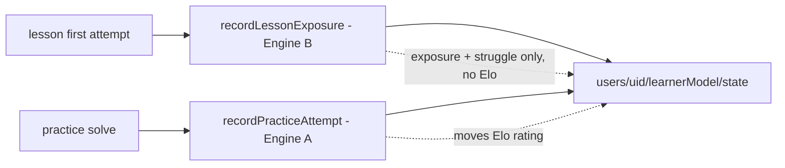

# Spec: Learner Model (Phase 2)

> New in Phase 2. Owns the per-learner mastery picture: which probability **skills** they're strong/weak in, which **misconceptions** they keep falling for, and the math that turns the existing append-only `stepAttempts` log into a small adaptive signal. Lives under `src/features/learner/`. Feeds [`spec-practice`](spec-practice.md) (adaptive difficulty + topic auto-suggest) and [`spec-ai-assist`](spec-ai-assist.md) (hint personalization + teach-the-recruit misconception flow).
>
> This spec reopens the [PRD §9.10 #8 negative criterion](../prd.md#910-scope--negative-criteria--10-acs) "no mastery scoring" — intentionally, for Phase 2 only. The lesson-level 3-state machine (`not_started` / `in_progress` / `completed`) is unchanged.

## Purpose

Give the app a small, interpretable, owner-only model of "what each learner is good and bad at" — enough to:

1. **Adapt practice difficulty** (Elo per skill, served-problem rating window).
2. **Pick the right topic** to suggest next (weakest skill's topic).
3. **Personalize hints** (the AI hint prompt knows the learner's top weakness + most-recent misconception).
4. **Surface "strengths / keep working on"** on Progress and Profile so adaptation is _visible_ to the learner.
5. **Feed the lesson report card** (immediate "what you nailed / what to watch" at lesson end).

Explicitly _not_ a knowledge-tracing PhD project: no BKT, no DKT, no IRT — those are Phase 3 territory. Elo + accuracy + a misconception counter is sufficient and interpretable.

## Two engines (owner decision, 2026-06-25)

The model serves two jobs that take **different inputs** and must not be conflated:

- **Engine A — Mastery rating (Elo).** Per-skill `rating` + recency-weighted accuracy. Updated **only by practice attempts** (deliberate, spaced retrieval — the valid mastery signal). Drives adaptive difficulty + topic targeting + the "Practiced: strong / keep working on" view. API: `applyPracticeAttempt` / `recordPracticeAttempt`.
- **Engine B — Exposure / struggle.** Per-skill `exposure` (introduced-in-a-lesson, first-try struggle count) + misconceptions. Updated **only by lesson first-attempts** (review excluded; first committed attempt per slot only — the no-bail-out retry grind carries no signal). Powers the lesson report card (immediate, in-lesson) + hint targeting + the "Introduced (not yet practiced)" view. API: `applyLessonExposure` / `recordLessonExposure`. **Engine B never moves the Elo `rating`.**

Why split: a correct answer moments after being taught (lessons) is weak evidence of durable mastery ("performance != learning"), and no-bail-out forces every completed lesson problem to end correct — so lessons can't honestly drive a mastery rating. Practice (chosen, spaced) can. Practice stays **fully optional / Alcumus-style** — weak skills are surfaced as invitations, never gates. See [`wp/wp-contracts.md`](wp/wp-contracts.md) C7 + [`wp/README.md`](wp/README.md) open-question #7.

## Non-negotiables

- **Owner-only.** The model lives under `users/{uid}/...` and is readable only by the learner. Firestore rules enforce this.
- **Materialized view, not source of truth.** The append-only `stepAttempts` log written by [`progressService.recordAttempt`](../../src/features/progress/progressService.ts) is the source of truth. The learner-model doc is a small, eventually-consistent projection — losing it loses _no_ history, just a cache.
- **No PII / no free text.** The model stores skill ids, misconception keys, counts, and ratings. Nothing the learner typed, nothing identifying.
- **Hand-authored taxonomy.** Skill ids and misconception keys are a closed enum in `src/content/skills.ts`. No auto-discovery, no embeddings, no clustering. (Cf. PRD §10 — RAG/embeddings explicitly rejected.)
- **Performance ≠ learning.** Recency-weighted accuracy is preferred over raw cumulative accuracy, and delayed retrieval (returning to a skill after a gap) is weighted higher than first-try retrieval right after teaching.

## Data model

### Skill taxonomy (closed enum, in-repo)

`src/content/skills.ts` exports a small flat taxonomy. Hand-authored; ~15–25 ids covering Phase 1's 5 lessons + the Phase 2 practice families.

```ts
// src/content/skills.ts
export const SKILLS = {
  // Lesson 1 — What is probability?
  'sample-space-enumeration': { label: 'Listing outcomes', topic: 'counting' },
  'equally-likely-outcomes':  { label: 'Equally likely outcomes', topic: 'counting' },
  'favorable-over-total':     { label: 'Favorable / total', topic: 'counting' },
  // Lesson 2 — Long-run frequency
  'long-run-vs-single-trial': { label: 'Long-run vs single trial', topic: 'long-run' },
  'frequentist-view':         { label: 'Probability as a share', topic: 'long-run' },
  // Lesson 3 — Counting carefully
  'multiplication-principle': { label: 'Multiplication principle', topic: 'counting' },
  'ordered-vs-unordered':     { label: 'Ordered vs unordered', topic: 'counting' },
  'permutations':             { label: 'Permutations', topic: 'counting' },
  'combinations':             { label: 'Combinations', topic: 'counting' },
  'complement-rule':          { label: 'Complement rule', topic: 'complement' },
  'independence':             { label: 'Independence', topic: 'complement' },
  // Lesson 4 — Counting gets hard
  'birthday-paradox':         { label: 'Birthday paradox intuition', topic: 'counting' },
  // Lesson 5 — Conditional probability
  'conditional-probability':  { label: 'Conditional probability', topic: 'conditional' },
  'base-rate':                { label: 'Base rates', topic: 'conditional' },
  'monty-hall-reasoning':     { label: 'Monty Hall reasoning', topic: 'conditional' },
  // Lesson 6 — Distributions (stub)
  'binomial-pmf':             { label: 'Binomial distribution', topic: 'distributions' },
} as const;

export type SkillId = keyof typeof SKILLS;
export type Topic = (typeof SKILLS)[SkillId]['topic'];
```

A short topic-id list (`counting`, `long-run`, `complement`, `conditional`, `distributions`) groups skills for the Practice topic picker.

### Misconception taxonomy (closed enum, in-repo)

`src/content/misconceptions.ts` exports the misconception ids we recognize. Most are **already named** in the lessons via distractor option ids (`gambler`, `biased`, `broken`, `incorrect-pair`, …). The Phase 2 taxonomy formalizes them and ties them to one or more skills:

```ts
export const MISCONCEPTIONS = {
  gambler:              { label: "Gambler's fallacy",                 relatedSkills: ['long-run-vs-single-trial', 'independence'] },
  ordered_vs_unordered: { label: 'Treats unordered pairs as ordered', relatedSkills: ['ordered-vs-unordered', 'combinations'] },
  conjunction:          { label: 'Conjunction fallacy',               relatedSkills: ['independence'] },
  base_rate_neglect:    { label: 'Ignores the base rate',             relatedSkills: ['base-rate', 'conditional-probability'] },
  complement_inversion: { label: 'Confuses event with complement',    relatedSkills: ['complement-rule'] },
  // ... extended as content lands
} as const;

export type MisconceptionKey = keyof typeof MISCONCEPTIONS;
```

### Content tagging (additive to existing types)

Add an optional `skills?: SkillId[]` field to `Variant` in [`src/content/types.ts`](../../src/content/types.ts):

```ts
type BaseVariant = {
  // ... existing fields ...
  /** Phase 2 — skill ids this variant exercises. Optional during migration;
   *  required for new variants (asserted in `assertLessonInvariants`). */
  skills?: SkillId[];
};
```

For multiple-choice variants we also want to map distractor options to misconceptions. This piggybacks on the existing `feedbackByOption` keys (which are already the per-distractor copy targets):

```ts
type MultipleChoiceVariant = BaseVariant & {
  // ... existing fields ...
  /** Phase 2 — optional map from option id to misconception key. */
  misconceptionByOption?: Record<string, MisconceptionKey>;
};
```

Backward-compatible (both fields optional). Old variants still render and grade unchanged; they just don't feed the learner model with as rich a signal until tagged.

### Firestore shape

```
users/{uid}/learnerModel/state               // single doc — small enough to read on demand
  {
    // Engine A — mastery, from PRACTICE only
    skills: {
      [skillId]: {
        rating: number,            // Elo (default 1000)
        attempts: number,          // cumulative practice attempts
        correct: number,
        recentCorrect: number,     // exp-decayed accuracy in [0, 1]
        lastSeenAt: number,
        firstSeenAt: number,
      }
    },
    // Engine B — exposure, from LESSON first-attempts only (never affects `rating`)
    exposure: {
      [skillId]: {
        introducedAt: number,
        lessonFirstTries: number,
        lessonFirstTryStruggles: number,
        lastSeenAt: number,
      }
    },
    misconceptions: {              // bumped by either engine
      [misconceptionKey]: { count: number, lastSeenAt: number }
    },
    weakestSkills: SkillId[],      // top 3 PRACTICED (Engine A) by lowest rating
    strongestSkills: SkillId[],    // top 3 PRACTICED (Engine A) by highest rating
    updatedAt: number,
  }
```

A skill can appear in `exposure` (met in a lesson) without appearing in `skills` (never practiced). The Strengths panel renders that as "Introduced — try practice." `weakestSkills`/`strongestSkills` are Engine-A only, so they never surface an un-practiced skill as a mastery judgment.

**Why one doc, not a subcollection per skill:** the model is small (≤25 skills × ~60 bytes), fits comfortably in one document, and the UI always wants the full picture (Strengths panel reads all skills at once). Single-doc reduces reads. Phase 3 can split if we ever have hundreds of skills.

### Firestore rules

```
match /users/{uid}/learnerModel/{docId} {
  allow read, write: if request.auth != null && request.auth.uid == uid;
}
```

Matches the existing `lessonProgress` and `stepAttempts` permissive owner-only pattern. No public projection (the strengths panel renders client-side from the owner-only doc).

## Mastery math

### Elo update

Per-skill Elo update, applied once per attempt for each skill the variant is tagged with:

```ts
const K = 24;
const learnerRating = state.skills[skillId]?.rating ?? 1000;
const problemRating = variant.difficulty ?? 1000;  // from template or hand-rated variant
const expected = 1 / (1 + 10 ** ((problemRating - learnerRating) / 400));
const actual = wasCorrect ? 1 : 0;
const newRating = learnerRating + K * (actual - expected);
```

`K = 24` is the standard chess starter; tunable. Variants without an explicit `difficulty` use 1000 (neutral) — this just means early attempts move the rating slower until templates with explicit ratings land.

### Recency-weighted accuracy

Cumulative `correct / attempts` is too inertial to drive a "strengths" panel that responds to recent practice. We track a recency-weighted version:

```ts
const ALPHA = 0.2;  // smoothing — higher = react faster to recent attempts
recentCorrect = ALPHA * (wasCorrect ? 1 : 0) + (1 - ALPHA) * (state.recentCorrect ?? 0.5);
```

Bootstrap at `0.5` for first-ever attempt so a new learner with one miss doesn't show 0% mastery.

### Delayed-retrieval weight (the learning-science adjustment)

A correct answer on a skill the learner _hasn't seen in days_ is a stronger learning signal than a correct answer on a skill they just finished a lesson on. We bias both the Elo update and the recency-weighted accuracy:

```ts
const daysSinceLastSeen = (now - state.skills[skillId]?.lastSeenAt) / DAY_MS;
// 1.0 baseline, up to 1.5x for skills not seen in >= 5 days
const delayedRetrievalBonus = Math.min(1 + daysSinceLastSeen / 10, 1.5);

if (wasCorrect) {
  newRating = learnerRating + K * delayedRetrievalBonus * (actual - expected);
}
```

This implements the notes' "first retrieval after forgetting has outsized effect" without committing us to a full FSRS-style spaced-repetition model.

### Top-N denormalization

After every update we recompute `weakestSkills` and `strongestSkills` (top 3 by rating, ties broken by `attempts`). Tiny work, makes the UI a single field read.

## Write path (two recorders)

New `learnerModelService.ts` exposes one recorder per engine; both are best-effort read-modify-write of the single state doc and never throw:

```ts
// Engine A — PRACTICE only (moves the Elo rating)
export async function recordPracticeAttempt(uid: string, input: {
  skills: SkillId[]; wasCorrect: boolean; difficulty?: number;
  misconceptionKey?: MisconceptionKey | null;
}): Promise<void>;

// Engine B — LESSON first-attempt only (exposure + struggle + misconception; NEVER moves the rating)
export async function recordLessonExposure(uid: string, input: {
  skills: SkillId[]; firstTryCorrect: boolean; misconceptionKey?: MisconceptionKey | null;
}): Promise<void>;
```

Wiring:
- **Practice loop (WP-6b)** calls `recordPracticeAttempt(...)` after each solve.
- **Lesson player (WP-2T)** calls `recordLessonExposure(...)` on the **first committed attempt per slot** (review excluded), and accumulates a `SlotFirstTry[]` for the report card. It must NEVER call `recordPracticeAttempt` — lessons do not move mastery.

If a write fails the attempt itself is unaffected — the model is a cache, not a gate.



**Idempotency / convergence.** Because `stepAttempts` is append-only and immutable, a learner-model doc can be **rebuilt from scratch** by replaying the log. A small one-shot Vite script (`scripts/rebuild-learner-model.ts`) is part of the spec for support cases — not deployed, just available.

## Read path (UI)

- **Strengths panel** (Progress + Profile): a single doc read renders the top 2–3 strongest and 2–3 weakest skills with their friendly `label` and a small mastery pip. No raw rating numbers shown (would feel pseudo-scientific).
- **Practice topic auto-suggest:** `Math.min(state.skills, by: 'rating')`'s `topic` is the default selection.
- **AI hint personalization:** the `/api/hint` payload includes
  `{ topWeakness: weakestSkills[0], recentMisconception: ... }` so the model
  can tune its nudge. See [`spec-ai-assist`](spec-ai-assist.md).

## Misconception flow

When a variant has `misconceptionByOption` and the learner picks a wrong option whose id is mapped, the matched key is passed to whichever recorder fired (`recordLessonExposure` in a lesson, `recordPracticeAttempt` in practice). Counters tick; the most-recent key (within ~24h) is the one F2's prompt receives. Misconceptions are shared across both engines (a single `misconceptions` map).

The teach-the-recruit feature (F4, [`spec-ai-assist`](spec-ai-assist.md)) emits `misconceptionFlags: MisconceptionKey[]` in its structured JSON; feed each to the misconception path (a thin `recordMisconceptions(uid, keys[])` helper, or `recordLessonExposure` with empty `skills`).

## Acceptance criteria

1. **Skill taxonomy lives in repo** at `src/content/skills.ts` with ≥15 ids covering all live lessons' core ideas.
2. **Misconception taxonomy lives in repo** at `src/content/misconceptions.ts` and includes at least `gambler`, `ordered_vs_unordered`, `base_rate_neglect`, `complement_inversion`.
3. **All live lesson variants are tagged** with `skills: SkillId[]` (asserted in `assertLessonInvariants`). New, untagged variants warn at content-load time.
4. **Two recorders, two engines.** `recordPracticeAttempt` updates Engine A (`skills[*].{rating,attempts,correct,recentCorrect,lastSeenAt}`); `recordLessonExposure` updates Engine B (`exposure[*]` + struggle counters). **`recordLessonExposure` never changes any `rating` or the weakest/strongest arrays** (verified by a pure-math test).
5. **Owner-only Firestore.** Read/write on `users/{uid}/learnerModel/*` is allowed only when `request.auth.uid == uid` — verified in emulator tests.
6. **No PII in the doc.** Schema audit asserts no field stores names, emails, free-typed strings, or anything originating from user input.
7. **Strengths panel visible.** Progress and Profile show "Strong / keep working on" (Engine A, practiced) plus "Introduced" (Engine B, lesson-only) — see [`wp-7`](wp/wp-7-strengths-panel.md).
8. **Feeds adaptive practice.** Practice's topic picker defaults to the topic owning `weakestSkills[0]` (Engine A); difficulty engine reads per-skill rating (cf. [`spec-practice`](spec-practice.md) §"Adaptive serving").
9. **Feeds AI hint + report card.** `/api/hint` bodies include the learner-model summary (cf. [`spec-ai-assist`](spec-ai-assist.md)); the lesson report card (WP-9) is built from Engine-B first-attempt results.
10. **Rebuildable.** A script can replay attempt history and reproduce the same `learnerModel/state` doc (modulo timestamps).

## Edge cases

| # | Case | Handling |
| --- | --- | --- |
| LM-E1 | New user, first PRACTICE attempt | Engine-A skills bootstrap at `rating: 1000`, `recentCorrect: 0.5`. A lesson-only user has empty `skills` (no mastery yet) but populated `exposure`. |
| LM-E2 | Variant tagged with skill ids that don't exist | `assertLessonInvariants` throws at content load with a pointer to the variant. |
| LM-E3 | Learner-model write fails | Logged; attempt unaffected; next attempt re-derives delta and converges. |
| LM-E4 | Cumulative `attempts == 0` but UI reads | UI shows the empty state ("Solve a few problems to see your strengths"). |
| LM-E5 | Two devices, simultaneous attempts | Last write wins on the doc; cumulative counters drift by at most one attempt. Next attempt converges. Acceptable for the cache. |
| LM-E6 | Re-tag a variant's `skills` after launch | Existing model unchanged (we don't re-walk history); future attempts use the new tags. |
| LM-E7 | `pruneStaleProgress` (D91) deletes a lesson's progress | Learner model is untouched (it lives in a separate subcollection). Acceptable: history is preserved. |

## Out of scope

- **BKT / DKT / IRT.** Phase 3.
- **Public mastery surface.** Strengths are private; no leaderboard, no public profile field.
- **Spaced-review scheduling system.** A simple "lastSeenAt" is here; a full review queue tied to `/progress` (D84) stays Phase 3.
- **Auto-discovery of new misconceptions.** All keys are hand-authored.
- **Skill prerequisites graph.** Tempting (which skill unlocks which) but Phase 3.

## Open questions

- **`K` constant and `ALPHA` smoothing values** are first-cut; should be tuned with real attempt data after launch.
- **Strengths panel copy** — needs friendly empty / "just starting" states.
- **Multi-skill variants and credit assignment** — for a variant tagged with two skills, should the Elo update be applied independently to each, or split? Current spec: applied independently to each (simple, mildly double-counts a small number of cross-cutting problems).
- **Decay** — if a learner never returns, should ratings drift back toward 1000 over weeks? Phase 3.
