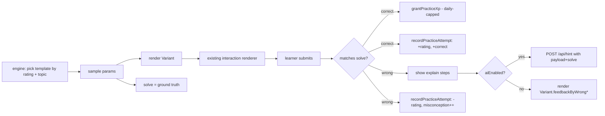

# Spec: Practice

> An endless, adaptive problem set where problems
> are effectively unlimited and **every problem + solution is vetted for
> correctness before a learner ever sees it**. Lives under `src/features/practice/`.
> Currently shipped as a locked nav stub (alternatives **D85**); this spec defines
> the real feature. The LLM-dependent tracks reopen the "no AI in MVP" decision
> (alternatives **D23**).

## Purpose

Give learners unlimited, right-sized practice on a chosen topic — solve, get
immediate feedback + a worked solution, and have the difficulty track their
ability so they're always working at the edge of competence. Alcumus is the
north star: pick a topic, keep solving, the system adapts.

The product promise is **two things at once**: _unlimited_ (so a learner never
runs out of reps) and _trustworthy_ (so the app never teaches a wrong answer).
Those two goals are in tension — unlimited pushes toward generation, trustworthy
pushes toward control. The whole architecture below exists to satisfy both.

### Learning-science rationale

- **Desirable difficulty / zone of proximal development.** Practice at the edge of
  ability (not too easy, not crushing) maximizes learning. Adaptive difficulty
  (§ Adaptive difficulty) keeps the learner there.
- **Retrieval practice + spacing.** Repeated active retrieval on a topic, spaced
  over time, builds durable memory. An endless bank makes spaced retrieval
  practical.
- **Immediate feedback + worked solutions (learning from errors).** A correct,
  fully worked solution shown right after an attempt is one of the highest-leverage
  learning events — which is exactly why a _wrong_ solution is so damaging, and why
  correctness vetting is non-negotiable.
- **Autonomy (SDT).** The learner chooses the topic and keeps control of pace.

## Non-negotiable principle: correctness

**An unvetted problem or solution must never reach a learner.** A teaching tool that
hands out a wrong answer key actively miseducates and destroys trust. Every other
design choice yields to this one.

Corollary — **the answer must come from code, not from an LLM.** The subject (HS
probability / combinatorics) is _computable_: answers are exact rationals or small
integers that a deterministic program can compute and verify. So the source of
truth for any answer is a solver, never a language model. LLMs are used (if at all)
to author _problems_ and _prose_, never to be the final arbiter of _correctness_.

> **Why not LLM-verifies-LLM as the gate?** Two models share training data and
> failure modes — they will confidently agree on the same wrong answer (correlated
> errors). An LLM verifier is a useful cheap _pre-filter_, but it is never the
> correctness gate.
>
> **Why not Lean / formal proof?** Wrong tool for a computable numeric domain. Lean
> proves theorems; we need to check that a computed number is the correct answer to
> a word problem. Autoformalization is itself error-prone, and a ~20-line exact
> solver is a sufficient correctness oracle here. (Revisit only if proof-style
> problems are ever added — out of scope.)

## Architecture: two tracks

### Track 1 — Parameterized generators (correct _by construction_) — **the Friday MVP**

A **template** is a hand-/LLM-authored problem family with code that computes its
own answer. Example: "two fair dice, P(sum = k)" with `k` a parameter.
Per alternatives **D99**, runtime templates are organized by Practice topic folder
(`src/features/practice/templates/<topic>/<id>.ts`), not a single flat templates
directory.

A template (`src/features/practice/templates/<topic>/<id>.ts`) declares:

- `id`, `topic`, a difficulty rating (or a function of params → rating).
- `sample(rng) → params` — draws a valid parameter set.
- `render(params) → { prompt, choices? }` — the problem statement (reuses the
  existing `{a/b}` Fraction template and interaction kinds from D29).
- `solve(params) → ExactAnswer` — the deterministic answer, as an exact rational
  (bigint numerator/denominator) or integer. **This is the source of truth.**
- `explain(params) → DerivationSteps` — the worked solution, built from the same
  computed quantities (reuses the D77 `derivation` shape).
- _(optional)_ `simulate(params, trials) → estimate` — a Monte-Carlo estimator used
  only to vet the template (see below).

**Why this is correct by construction:** at runtime we `sample → render → solve`.
No LLM is in the answer path, so every generated instance is exactly right. "Unlimited"
comes from the parameter space; "correct" comes from `solve()` being plain code.

**Template vetting (build-time, once per template):**

- Unit test: for ≥1,000 sampled param sets, assert `solve()` agrees with
  `simulate()` within a Monte-Carlo tolerance (`|p̂ − p| < 5·√(p(1−p)/n)` and exact
  cases enumerated where the sample space is small). This catches a buggy `solve()`.
- Human review of the template + a rendered sample before it ships.
- Templates are code in the repo → they go through normal review + CI (D40), same
  as lesson content (D35).

LLM's role here: **accelerate authoring templates** (draft `render`/`explain` prose,
propose new families). A human + the simulation test sign off. The LLM never
computes a served answer.

### Track 2 — Free-form LLM-generated bank (variety, heavily gated) — **post-Friday**

For variety beyond what templates express, an LLM generates one-off problems
**offline, in batches**, and each candidate must clear an independent gauntlet
before being added to the bank:

1. **Structured output.** The model returns `{ prompt, answer, solution, and an
executable solver snippet }` in a strict schema.
2. **Independent code verification (the gate).** Run the solver snippet in a sandbox
   **and** an independent reference computation (exact enumeration / rational
   arithmetic) **and** a Monte-Carlo cross-check. All must agree on `answer` within
   tolerance. Disagreement → reject.
3. **Well-posedness checks.** Single unambiguous answer, no under-/over-specification,
   numbers in sane ranges, answer matches the asked quantity/units.
4. **Second-model pre-filter + self-consistency** (cheap filters, not the gate):
   regenerate the answer N times; a different model critiques. Reduces load on the
   code gate; never replaces it.
5. **Safety / age-appropriateness** content filter.
6. **Human spot-check** of a random sample of each batch before publish; track the
   batch's measured defect rate.

Only candidates passing **1–5** (and sampled into 6) are written to the vetted bank.
**Code agreement (step 2) is the gate; the LLM verifier is only a pre-filter.**

> Generation/verification tooling lives in `scripts/practice/` (Node, offline) — it
> is **not** shipped in the client bundle and makes no runtime model calls.

## Runtime model

- **No live LLM calls at request time.** The app serves from pre-vetted sources:
  Track 1 generates instances client-side from in-repo templates (code, instant);
  Track 2 reads vetted problems from a bank.
- This keeps latency instant, cost bounded, and removes the runtime prompt-injection
  / jailbreak surface. (Generation cost is paid offline, once, per batch.)

## Data model

- **Track 1** needs no problem storage — instances are generated from code templates
  on device. Only the _attempt outcome_ feeds adaptive state.
- **Track 2** vetted bank: `practiceProblems/{problemId}` (public-read, no client
  writes; populated only by the offline pipeline) with `topic`, `rating`, `prompt`,
  `choices?`, `answer`, `solution`, `provenance` (template id or generation batch +
  verification record).
- **Per-user practice state:** `users/{uid}/practice/{topicId}` —
  `{ rating, attempts, correct, lastSeenProblemIds[], updatedAt }`. Owner-only
  read/write (Firestore rules), consistent with the rest of `users/{uid}`. No PII;
  if a public surface is ever wanted, mirror to `publicProfiles` like D80 — out of
  scope here.

## Adaptive difficulty

- Each problem (or template-instance) has a **difficulty rating**; each learner has a
  **per-topic rating**. Serve problems near the learner's current rating (slightly
  above for desirable difficulty).
- Update ratings on each attempt with a lightweight Elo/Glicko-style rule (correct →
  rating up, harder if the problem was hard; incorrect → down). Tunable constants,
  not validated yet (flag as a risk).
- Avoid immediate repeats via `lastSeenProblemIds` / recent-params memory.
- This mirrors Alcumus's rating-based progression; full IRT calibration is out of
  scope for the first version.

## User-facing behavior

- `/practice`: choose a **topic** (mapped to the existing lesson concepts:
  basic probability, counting/combinatorics, conditional probability, …).
- Solve loop: see a problem → answer (reusing existing interaction kinds) → immediate
  correct/incorrect feedback → a fully **worked solution** (D77 derivation shape) →
  "Next problem". Endless until the learner stops.
- Lightweight session signals: streak of correct-in-a-row, count solved, current
  topic rating trend.
- **XP integration (decided):** a correct practice problem awards **difficulty-scaled
  XP** — Easy 3 / Medium 5 / Hard 8 / Expert 12 (`PRACTICE_XP_BY_DIFFICULTY`),
  bucketed from the problem's Elo (`difficultyBucket`) — **capped per local day**
  (`PRACTICE_DAILY_XP_CAP = 100`). Harder problems pay more so grinding easy ones
  can't out-earn real challenge, while the daily cap still keeps practice from
  dwarfing the path. _(Supersedes the original flat `PRACTICE_XP_PER_CORRECT = 5`;
  decision D100.)_ Practice XP feeds **total XP (levels) and weekly XP
  (leaderboard)** but does **not** tick the daily streak and is **not** counted as
  a completed lesson — the streak stays tied to the core daily goal. The cap policy
  is pure, tested logic in `src/lib/practiceXp.ts` (`grantPracticeXp`, now taking
  an explicit award amount); the solve loop calls it and persists the per-day state.
  Difficulty itself is hand-rated per template today (`rate(params)`), with an
  optional offline LLM annotation pass planned — see
  [`spec-ai-difficulty-annotation`](spec-ai-difficulty-annotation.md) (D101).
- Empty/again-later states handled like the rest of the app.

## Security & safety

- Per-user practice state is owner-only (Firestore rules), like `users/{uid}`.
- `practiceProblems` is read-only to clients; only the offline pipeline (privileged)
  writes it. No client path can inject an unvetted problem.
- No model API keys in the client build (preserves the D23 §9.10 "no AI in bundle"
  property for the _shipped app_ even after the offline pipeline exists). Keys live
  only in the offline tooling environment.

## Acceptance criteria

1. A learner can pick a topic and solve an unbounded sequence of problems, each with
   immediate feedback and a worked solution.
2. **Every served problem's answer is computed by code** (Track 1) **or** was gated by
   independent code verification before publish (Track 2). No served answer originates
   from an unverified LLM output.
3. Track 1 templates have a passing build-time test that `solve()` matches simulation
   over ≥1,000 sampled params (and exact enumeration where feasible).
4. Difficulty adapts: a learner answering correctly trends toward harder problems and
   vice-versa, within a topic.
5. The shipped client bundle contains no model SDK or API key (`git grep` clean, per
   the D23 §9.10 check).
6. Per-user practice state is owner-only; clients cannot write `practiceProblems`.

## Phasing

- **Friday (v1):** Track 1 only — a handful of parameterized topics, generated
  client-side from in-repo templates, served from code (no Firestore bank, no runtime
  LLM), with rating-based adaptive serving and worked solutions. Correctness is
  guaranteed by construction. Unlock the nav item.
- **v2:** Track 2 offline generation+verification pipeline (`scripts/practice/`),
  vetted `practiceProblems` bank, batch publishing with defect-rate tracking.
- **v3:** Better calibration (IRT), more topics, cross-topic mixed sets, optional
  spaced-review scheduling tie-in with `/progress` (D84).

## Out of scope

- Live, per-request LLM generation (latency/cost/safety — always offline + vetted).
- Lean / formal proof verification for the numeric core (wrong tool; revisit only for
  future proof-style content).
- Proof-based or open-response problems (numeric / multiple-choice / structured only
  for v1–v2).
- Multiplayer / timed competitive practice (Phase 3+).
- Using the practice rating as a public/social ranking (keep it private; revisit with
  D24/D80 framing if ever wanted).

## Open questions

- ~~**XP/streak interaction:**~~ **Resolved** — practice awards a small, flat,
  daily-capped XP (`lib/practiceXp.ts`: 5/correct, 100/day) that feeds levels +
  weekly XP but does **not** tick the streak or count as a lesson. See
  "XP integration (decided)" above.
- **Daily-cap data model:** persist the per-day counter as
  `users/{uid}.practiceXp = { date, earnedToday }` (owner-only, mirrors the rest
  of `users/{uid}`). Resets when `date` rolls over (handled by `grantPracticeXp`).
- ~~**Topic taxonomy:**~~ **Resolved (Phase 2)** — neither raw lesson ids nor a deep
  skill tree. A small flat **skill taxonomy** in `src/content/skills.ts`
  (~15–25 ids); each variant carries `skills: string[]`. Topics on the
  Practice page are presentation-only groupings of skill ids. Details:
  [`spec-learner-model`](spec-learner-model.md).
- **Track 2 acceptable defect rate** and human-review sampling rate before a batch may
  publish.
- **Generation cost ceiling** per topic/batch, and whether a curated seed bank anchors
  generation.

---

## Phase 2 — Track 1 implementation specifics

> Added 2026-06-25 as part of the Phase 2 AI build. Resolves the "Phasing →
> Friday (v1)" section above with the concrete schema, math, and content
> surface the implementer needs. The principles above (correctness, no live
> LLM, owner-only state, no SDK in bundle) are unchanged — this section is
> all "how," not "what."

### Template schema (TypeScript)

`src/features/practice/templates/types.ts` defines the contract:

```ts
import type { Variant } from '@/content/types';

export type ExactAnswer =
  | { kind: 'int'; value: number }
  | { kind: 'fraction'; num: bigint; den: bigint }  // already reduced
  | { kind: 'choice'; optionId: string };

export type Template<Params = unknown> = {
  /** Unique id, kebab-case (e.g. `sum-of-two-dice`). */
  id: string;
  /** Presentation grouping shown on /practice (e.g. `counting`, `complement`). */
  topic: string;
  /** Skill ids touched by this family (from src/content/skills.ts). */
  skills: string[];
  /** Which retrieval form the family targets — drives interleaving order. */
  retrievalForm: 'definition' | 'operation' | 'procedural' | 'application';
  /**
   * Difficulty rating produced from params. Higher = harder. Calibrated by
   * authoring (rough Elo-equivalent), tuned post-launch with attempt data.
   */
  rate(params: Params): number;
  /** Draw a valid parameter set. Deterministic given `rng`. */
  sample(rng: () => number): Params;
  /**
   * Build a `Variant` so the practice loop can reuse the existing interaction
   * renderers (no new UI). Use `multiple-choice`, `fill-fraction`, or
   * `tap-event` for v1; richer kinds opt in later.
   */
  render(params: Params): Variant;
  /** The deterministic correct answer. THE SOURCE OF TRUTH. */
  solve(params: Params): ExactAnswer;
  /** Worked solution, reusing the D77 derivation shape. */
  explain(params: Params): { title: string; steps: string[] };
  /**
   * Monte-Carlo estimator used only at template-vetting time. Required for
   * probability-of-event templates; omit for deterministic-count templates.
   */
  simulate?(params: Params, trials: number, rng: () => number): number;
};
```

A template **does not** ship to learners until its vetting test passes (next subsection).

### Template vetting test (CI gate)

Every template ships with a sibling `<template>.test.ts` that runs at build
time and gates CI. The standard test is parameterized so adding a template is
"add file + add `expectTemplateAgrees(template)` line":

```ts
// Pseudocode — actual helper lives in src/features/practice/templates/testUtils.ts
expectTemplateAgrees(sumOfTwoDice, {
  samples: 1_000,
  trials: 10_000,
  // 5-sigma tolerance: |p̂ − p| < 5·√(p(1−p)/n)
  tolerance: 5,
});
```

The helper:

1. Seeds `mulberry32` from a fixed test seed (so failures are reproducible).
2. Draws ≥1,000 parameter sets via `sample()`.
3. For each, computes `p = solve(params)` and (when `simulate` is defined) an
   estimate `p̂ = simulate(params, trials)`.
4. Asserts `|p̂ − p| < tolerance · √(p(1−p) / trials)`.
5. Additionally exact-enumerates the sample space when it is ≤ 10⁴ outcomes
   (e.g. two-dice: 36 outcomes) and asserts `solve` matches.

A failing template **blocks the build** — the spec's "every served problem's
answer is computed by code" guarantee depends on this gate.

### First template families (Friday surface)

Six families covering the foundational ~20% of curriculum skills (see PRD §8
"20% drives 80%"). Each family generates a wide parameter space, so total
practice surface ≫ 6 problems.

| id | Topic | Skills | Retrieval form | `solve` shape |
| --- | --- | --- | --- | --- |
| `sum-of-two-dice` | counting | `sample-space-enumeration`, `equally-likely-outcomes` | operation | exact fraction by enumeration |
| `at-least-one-via-complement` | complement | `complement-rule`, `independence` | procedural | `1 − (1−p)^n` exact |
| `k-heads-in-n` | distributions | `binomial-pmf`, `independence` | operation | binomial coefficient × `p^k(1−p)^(n−k)` |
| `pick-k-of-n-unordered` | counting | `ordered-vs-unordered`, `combinations` | definition | `nCk` exact |
| `conditional-bayes-2x2` | conditional | `conditional-probability`, `base-rate` | application | exact fraction from 2×2 table |
| `gambler-fallacy-mc` | long-run | `long-run-vs-single-trial`, `independence` | definition | structured-choice (no number) |

Each family file pattern:
`src/features/practice/templates/<topic>/<id>.ts` (template) +
`src/features/practice/templates/<topic>/<id>.test.ts` (vetting test). The
single WP-3 registry imports from these topic folders and exposes one flat
`TEMPLATES` array.

### Retrieval-form organization (interleaving rule)

The four retrieval forms from the learning-science notes — **definition,
operation, procedural, application** — are first-class on the template
metadata. The engine interleaves _retrieval forms_ within a topic, not just
template ids: a learner working on `complement` sees the definition-form
problem ("which statement defines the complement rule?"), the operation
problem ("compute P(at least one) for given n and p"), the procedural problem
("decompose this scenario into a complement"), and the application problem
("which real-world setup is best solved with the complement rule?") in
mixed order — desirable difficulty, not surface-feature ordering. This is the
interleaving lever the engine pulls inside a single topic; cross-topic mixed
sets stay out of scope for v1.

### Adaptive serving (concrete math)

Adaptive difficulty uses a lightweight Elo update per skill, calibrated to
target ~20–30% miss rate (failure >50% demotivates — see notes). The rule:

```ts
// learner: { rating: number }, problem: { rating: number }
const K = 24;                                  // learning-rate constant
const expected = 1 / (1 + 10 ** ((problem.rating - learner.rating) / 400));
const actual = wasCorrect ? 1 : 0;
learner.rating += K * (actual - expected);
```

- New learners start at rating 1000 per skill.
- Templates start with hand-rated difficulty (the `rate(params)` function);
  these calibrate to learner performance over time but are not auto-tuned in
  v1 (flagged risk).
- **Serving:** pick a template whose `rate(params)` is in the window
  `[learner.rating − 50, learner.rating + 100]` (slightly _above_ — desirable
  difficulty). If no template fits, widen the window symmetrically. Avoid
  any template whose last instance was served in the last 3 problems
  (`lastSeenTemplateIds`).
- **Topic auto-suggest:** Practice's default-selected topic is the topic
  whose **weakest skill** the learner has the lowest rating on — read from
  the learner model.

### Worked solution rendering

`explain(params)` returns `{ title, steps }` which the practice loop renders
through the existing `DerivationCard` (D77 shape). No new component. After a
wrong answer the worked solution always appears (worked-example effect —
strongest right after a miss); after a correct answer it appears under a
"See the working" disclosure (so the learner is forced to retrieve, then can
self-check).

### Loop-level data flow



- **No runtime LLM call is required for the practice loop to function.** The
  hint surface is opt-in via `VITE_AI_ENABLED`; with it off the loop falls
  back to the variant's authored feedback per the rest of the app.
- The learner-model write path mirrors `recordAttempt` — see
  [`spec-learner-model`](spec-learner-model.md).

### Data-model addendum (Phase 2)

Two small additions to the Phase 1 data shape; both owner-only subdocs to
avoid the tight `/users/{uid}` update allowlist in `firestore.rules`:

- `users/{uid}/practiceState/{topicId}` —
  `{ rating, attempts, correct, lastSeenTemplateIds[], updatedAt }`. (Replaces
  the original spec's `users/{uid}/practice/{topicId}` location to keep the
  user-doc rule untouched.)
- `users/{uid}/practiceXp/today` — `{ date, earnedToday }`. (Replaces the
  earlier "open question" of putting it on the user doc; subdoc keeps rules
  simple.)

Rules: owner-only `read, write` on both subcollections — same shape as the
existing `lessonProgress` and `stepAttempts` rules.

### What the LLM did (and didn't do) for these templates

Templates were **authored by hand**, with LLM assistance for prose drafts of
`render(params).prompt` and `explain(params).steps` only — reviewed by the
content owner before commit (same posture as `D74` for lesson copy). The
LLM never wrote `solve()`, and the vetting test re-derives the answer from
`solve()` independently. So the **shipped answer path contains zero LLM
output** — which is the precondition for unlocking the practice section
without violating PRD §9.10 AC #1.

### Acceptance criteria addendum

Augments the original 6 ACs above:

7. **Template-test gate.** CI fails when any template's vetting test fails;
   no template can ship without `solve()` matching `simulate()` (or exact
   enumeration) within tolerance.
8. **Retrieval-form metadata present.** Every template declares
   `retrievalForm` and `skills`; the engine respects both when serving.
9. **Adaptive miss-rate target.** Over a session of ≥20 problems, the
   learner's observed wrong-rate falls within 15–40% (loose band around the
   20–30% target; tightens with more attempt data in v2).
