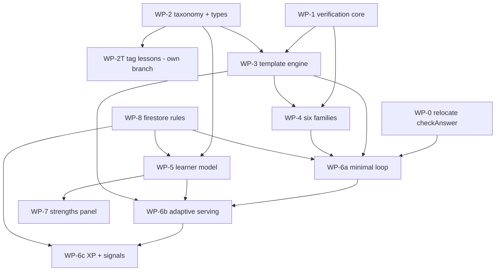

# Phase 2 — Work Packages (autonomous build units)

> Self-contained, low-interdependency specs so a smaller model (Sonnet / Composer) can pick up one WP and loop to completion against a frozen interface. Read [`wp-contracts.md`](wp-contracts.md) FIRST — it freezes every shared signature so WPs don't block each other.
>
> Scope of this batch: **client-side, non-AI, non-server** Phase 2 work (the practice spine + learner model + verification). The Vercel/Gemini AI surfaces (hint, teach-the-recruit) are specced separately in [`../spec-ai-assist.md`](../spec-ai-assist.md) and are NOT in this batch.

## The one rule that keeps WPs independent

**Build against [`wp-contracts.md`](wp-contracts.md), never against a sibling WP's internals.** If you think a contract must change, STOP, log it under "Open questions" below, and consult the owner. Silently diverging from a contract breaks other WPs.

Each WP spec has the same shape: Goal -> Files -> Steps (loop until green) -> Test plan / Definition of Done -> Boundaries (do NOT touch). Every WP ends with `npm run typecheck` clean and its tests green; UI WPs also `npm run build` clean. The app must stay deployable and fully usable after each WP.

## Work packages

| WP | Title | Depends on | Parallel-safe with | Server/AI |
| --- | --- | --- | --- | --- |
| [WP-T](wp-t-test-harness.md) | React Testing Library + jsdom harness | — | everything | no |
| [WP-0](wp-0-relocate-checkanswer.md) | Relocate `checkAnswer` to `src/lib/` | — | everything | no |
| [WP-1](wp-1-verification-core.md) | Verification core (exact + sim cross-check) | — | WP-0, 2, 2T, 8 | no |
| [WP-2](wp-2-taxonomy.md) | Taxonomy + content-model additions | — | WP-0, 1, 8 | no |
| [WP-2T](wp-2t-tag-lessons.md) | Tag existing lessons (own branch) | WP-2 | WP-1, 3, 4, 5, 8 | no |
| [WP-3](wp-3-template-engine.md) | Template engine + registry | WP-1, WP-2 | WP-5, 8 | no |
| [WP-4](wp-4-template-families.md) | 6 template families (each independent) | WP-1, WP-3 | each family parallel | no |
| [WP-5](wp-5-learner-model.md) | Learner model (pure + service) | WP-2, WP-8 | WP-3, 4 | no |
| [WP-6a](wp-6a-practice-loop-minimal.md) | Minimal practice loop (1 template) | WP-0, 3, 4(>=1), 8* | WP-7 | no |
| [WP-6b](wp-6b-adaptive-serving.md) | Adaptive serving + topic picker | WP-6a, 5, 3, 8 | — | no |
| [WP-6c](wp-6c-xp-and-signals.md) | Practice XP + session signals | WP-6b, 8 | — | no |
| [WP-7](wp-7-strengths-panel.md) | Strengths panel (Introduced vs Practiced) | WP-5 | WP-6* | no |
| [WP-8](wp-8-firestore-rules.md) | Firestore rules for new subcollections | — | everything | no |
| [WP-9](wp-9-lesson-report-card.md) | Lesson report card on celebration (Engine B) | WP-2, WP-T | WP-6* | no |

\* WP-6a can run with no Firestore writes; it needs WP-8 only once it persists state (6b onward).

## Dependency graph & suggested order

**Wave 1 (no deps, fully parallel):** WP-T, WP-0, WP-1, WP-2, WP-8.
**Wave 2 (after wave 1):** WP-3 (needs 1+2), WP-5 (needs 2+8), WP-2T (needs 2; own branch), WP-9 (needs 2+T).
**Wave 3:** WP-4 ×6 (needs 1+3; all parallel), WP-6a (needs 0+3+4>=1+8+T), WP-7 (needs 5+T).
**Wave 4:** WP-6b (needs 6a+5+3), then WP-6c (needs 6b).

A single agent can also just walk WP-T -> WP-0 -> WP-1 -> WP-2 -> WP-8 -> WP-3 -> WP-5 -> WP-9 -> WP-4 -> WP-6a -> WP-6b -> WP-6c -> WP-7, with WP-2T on a side branch.

## Logged open questions (consult owner before diverging)

> Per the owner's instruction: design questions and foreseeable conflicts are logged here. Items marked RESOLVED have a locked decision; items marked OPEN need a call if an implementer hits them.

1. **RESOLVED — skills tagging.** `skills?` is optional in the type (WP-2); all live lessons are tagged in WP-2T on its own branch. Flipping `skills` to required is deferred until after WP-2T merges.
2. **RESOLVED — `checkAnswer` location.** Relocated to `src/lib/` (WP-0); practice and lesson both import from there.
3. **RESOLVED — practice UI phasing.** Split into WP-6a (minimal) / 6b (adaptive) / 6c (XP+signals).
4. **RESOLVED — difficulty scale.** Template `rate()` and learner ratings share one Elo scale (~700-2000, default 1000). Locked in [C5](wp-contracts.md#c5-template-contract-owned-by-wp-3-implemented-by-wp-4-consumed-by-wp-6)/[C7](wp-contracts.md#c7-learner-model-owned-by-wp-5-consumed-by-wp-3-serving-wp-6-wp-7).
5. **RESOLVED — practice problems are ephemeral.** No mid-problem resume; only aggregate state (rating, recent templates, daily XP) persists. Simplifies WP-6 (no per-instance Firestore doc).
6. **RESOLVED — lesson variants have no `difficulty`.** Lesson attempts feeding the learner model use `DEFAULT_RATING` (1000); only template-instances carry a real `difficulty`. Acceptable; revisit if lesson signal looks off.
7. **RESOLVED (owner, 2026-06-25) — TWO-ENGINE split; lessons never touch the mastery Elo.** The learner model serves two distinct jobs and they take different inputs:
   - **Engine A — Mastery rating (Elo).** Drives adaptive practice difficulty + topic targeting. Fed ONLY by **practice** (deliberate, spaced retrieval — the valid mastery signal). Practice is **fully optional / Alcumus-style jump-around** — NO forced gates; weak skills are surfaced as *invitations*, never requirements.
   - **Engine B — Lesson exposure/struggle + in-lesson report card.** Fed by **lesson first-attempt data** (review mode excluded, FIRST committed attempt per slot only — the no-bail-out retry grind is ignored). Contributes: `introduced[skill]`, a first-try struggle flag, and **misconceptions** (first wrong attempt matched to `misconceptionByOption`). It powers (a) a Khan-style **lesson report card** on the celebration screen (new **WP-9**, no AI) and (b) hint targeting + an "Introduced vs Practiced" view in the Strengths panel. **It does NOT move the Elo rating.**
   - Contract impact: C7 gains an exposure concept + a lesson-outcome API distinct from the practice Elo update. WP-5, WP-2T, WP-7 adjust accordingly; WP-9 is new.
8. **RESOLVED (owner choice, 2026-06-25) — add a real component-test harness.** Owner chose reliability over speed: set up **React Testing Library + jsdom** as a one-time infra task (**WP-T**) and have the UI WPs (6a/6b/6c/7, and WP-9) ship real component tests (render -> interact -> assert), not just pure-helper tests + manual smoke. WP-T is a prerequisite for the UI WPs.
9. **OPEN — `gambler-fallacy-mc` realism.** A conceptual MC template has a tiny param space (mostly flavor). It may feel repetitive in long sessions. Acceptable for v1? Or drop it for a second numeric family? Default: keep it (it targets the highest-value misconception). **Consult if it reads as repetitive in testing.**
10. **RESOLVED (D99, 2026-06-25) — WP-4 template files use topic folders.** The original flat path (`src/features/practice/templates/<id>.ts`) is superseded by `src/features/practice/templates/<topic>/<id>.ts`. This is a layout decision only: C5/C6 stay frozen, WP-3 still owns one flat `TEMPLATES` registry, and WP-6 consumes the same engine contract. Read [`wp-4-layout-handoff.md`](wp-4-layout-handoff.md) before running WP-4.

## Foreseeable conflicts / risks (logged)

- **R1 — `render`/`solve` drift.** A template could render correctness fields that disagree with `solve()`. Mitigation: the WP-1 vetting helper asserts `checkAnswer(render(params), answerToPayload(solve(params)))` is correct for every sampled instance. Build WP-1 before WP-4.
- **R2 — `answerToPayload` for `int` answers.** Integer answers only make sense for `multiple-choice` (as a choice) or a count rendered as MC. The `pick-k-of-n-unordered` family returns `{kind:'int'}` but renders MC, so its `render` maps the int to the correct option id, and grading uses `choice`. Ensure `answerToPayload` + the family agree (covered by its vetting test). **WP-3 and WP-4 authors: coordinate via the contract, not ad hoc.**
- **R3 — practice XP double-write path.** WP-6c must reuse the existing habit XP increment (allowlisted `xp`/`weeklyXp`/`weekKey`); inventing a new write risks tripping the `users` update rule. Mitigation: boundary note in WP-6c.
- **R4 — UI WP scope creep.** WP-6a is the riskiest single task. Mitigation: it's deliberately minimal (one template, no persistence); 6b/6c layer on.
- **R5 — simulate() tolerance flakiness.** Monte-Carlo cross-checks can rarely exceed a 5-sigma band by chance. Mitigation: fixed test seed (deterministic), generous 5-sigma tolerance, and exact-enumeration for small sample spaces.

## Out of this batch (separate specs)

- AI hint / explanation (`/api/hint`) and teach-the-recruit (`/api/teach`) — [`../spec-ai-assist.md`](../spec-ai-assist.md).
- Offline vetted bank + session recap (stretch) — [`../spec-practice.md`](../spec-practice.md) §Track 2 + [`../prd-phase2.md`](../prd-phase2.md) F5.
- Unit-test coverage expansion across the app — owner flagged as a later pass.
