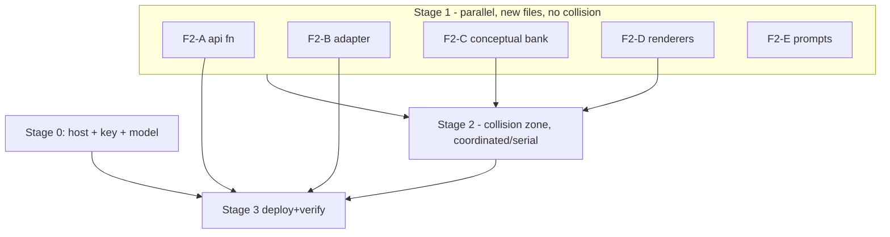

# F2 Build Plan — free-response practice + 3-try hint ladder + two-part conceptual

> Staged, parallelizable implementation plan for the F2 design in [`spec-ai-assist`](../spec-ai-assist.md) §"Refinement … the chosen F2 build" (decision D102). Structured so smaller models (Sonnet / Composer) can each own a work package against the **frozen contracts** in §C, with the **collision zones** (files the practice-redesign workstream owns) clearly fenced off.

## The one rule (so this doesn't repeat the practice-page collision)

**Two zones:**

- 🟢 **SAFE-NOW (new files, no overlap)** — build in parallel immediately: the `/api` function, the OpenAI `callModel`, the client adapter, the conceptual-problem *bank/types in their own new files*, the new interaction renderers, and pure logic. None of these are touched by the practice/curriculum agents.
- 🔴 **COLLISION ZONE (coordinate / sequence)** — `src/features/practice/PracticeSession.tsx`, `practiceEngine.ts`, the template files, `practiceXp.ts`, and `src/content/types.ts` are **actively owned by the practice-redesign + curriculum workstreams.** Do NOT edit these concurrently — either hand these WPs to that agent or serialize after they settle.

Build all of Stage 1 (🟢) now; gate Stage 2 (🔴) on coordination.

## §C — Frozen contracts (build against these, not each other)

### C-1. `callModel` (provider abstraction — OpenAI)
`api/_lib/callModel.ts`
```ts
export type ModelMessage = { role: 'system' | 'user'; content: string };
/** Single-shot call to OpenAI chat completions. Model from env (OPENAI_MODEL). Returns raw text. */
export async function callModel(messages: ModelMessage[], opts?: { json?: boolean }): Promise<string>;
```
Key: `process.env.OPENAI_API_KEY` (server-side only). Never imported by client code.

### C-2. `/api/hint` request/response
```jsonc
// REQUEST (POST, Authorization: Bearer <Firebase ID token>)
{
  "mode": "computational" | "conceptual",
  "tryNumber": 1 | 2 | 3,
  "problem": { "prompt": "...", "context": "..."? },
  "learnerAnswer": { /* the numeric fill, or { answer, why } for conceptual */ },
  "ground": {                       // server fills/validates this; the bank, NOT the model
    "answer": "1/2",                // canonical answer (string form)
    "canonicalWhy": "..."?,         // conceptual reasoning (for reveal only)
    "rubricKeyPoints": ["..."]?,    // conceptual: what a correct 'why' must hit
    "misconceptions": ["gambler"]?  // conceptual: closed-set keys to classify against
  },
  "learnerSummary": { "topWeakness": "...", "recentMisconception": "..." }?
}
// RESPONSE 200
{
  "text": "string (the hint; NEVER the answer when tryNumber < 3)",
  "classification": "correct-reasoning" | "misconception" | "irrelevant" | null,  // conceptual only
  "misconceptionKey": "gambler" | null,                                          // conceptual only
  "modelVersion": "..."
}
// 401 unauth · 429 rate-limited · 503 { "fallback": true } on any failure
```
Rules: server computes/loads `ground` **before** the model call; system prompt forbids revealing the answer for `tryNumber < 3`; conceptual `classification`/`misconceptionKey` come from mapping the "why" onto `rubricKeyPoints` + `misconceptions` (closed set), never open judgment; learner text is wrapped as data (injection-contained); response schema-validated or → fallback.

### C-3. Client adapter
`src/features/ai/useAiHint.ts`
```ts
export type HintRequest = { mode: 'computational'|'conceptual'; tryNumber: 1|2|3; /* …C-2 fields… */ };
export type HintResult = { text: string; classification?: string|null; misconceptionKey?: string|null; fallbackUsed: boolean };
/** Calls /api/hint; on !ok / aiDisabled returns { fallbackUsed: true } so caller shows authored copy. */
export function useAiHint(): { requestHint: (req: HintRequest) => Promise<HintResult> };
```
Gated by `VITE_AI_ENABLED`; base URL from `VITE_AI_API_BASE` (so the function can live on a different origin + CORS).

### C-4. Conceptual problem bank (new type, NEW file — do NOT edit `content/types.ts`)
`src/content/conceptual/types.ts`
```ts
export type ConceptualProblem = {
  id: string;
  prompt: string;
  answer: ExactAnswer;            // part 1 — code-verified
  rubricKeyPoints: string[];      // part 2 — what a correct 'why' must hit
  misconceptions: MisconceptionKey[];
  canonicalWhy: string;           // shown on reveal (bank, not model)
};
```

### C-5. Per-try XP (pure)
Add `xpForTry(baseAward: number, tryNumber: 1|2|3): number` → `try1=base, try2=round(base/2), try3=max(1,round(base/4))`, revealed→0. **Lives in `practiceXp.ts` (🔴 collision file)** — implement as a pure function; coordinate the edit.

## Stages & work packages

### Stage 0 — prerequisites (owner decisions)
- Host for the function reachable from the deployed site (standalone Vercel fn + CORS recommended). 🔴 owner action (deploy).
- `OPENAI_API_KEY` set **server-side only**; `OPENAI_MODEL` chosen.
- XP policy: CONFIRMED (try1 full / try2 half / try3 quarter / reveal 0).

### Stage 1 — SAFE, PARALLEL (🟢 new files; dispatch now)
| WP | Scope | Files (all new) | Deps |
| --- | --- | --- | --- |
| **F2-A** | OpenAI `callModel` + `/api/hint` function (token verify, ground-first, no-reveal prompt, conceptual rubric classify, schema, rate-limit) | `api/_lib/callModel.ts`, `api/hint.ts`, tests | C-1, C-2 |
| **F2-B** | client adapter + flag + fallback | `src/features/ai/useAiHint.ts` (+ test) | C-3 |
| **F2-C** | conceptual bank: types + 3–4 seed problems (answer+rubric+misconceptions+canonicalWhy) | `src/content/conceptual/*` | C-4, taxonomy |
| **F2-D** | new renderers: `NumberFill` (single integer) + `AnswerWhy` (part1 input + part2 textarea), standalone, prop-driven | `src/features/practice/renderers/*` (new) | InteractionProps shape |
| **F2-E** | pure prompt builders + rubric-classification helper (shared with F4), unit-tested | `api/_lib/prompts.ts` (+ test) | C-2 |

These 5 touch only new files → up to 5 small models in parallel. Each: typecheck + its tests green; the function/adapter are host-agnostic and dormant until Stage 3.

### Stage 2 — COLLISION ZONE (🔴 coordinate with the practice agent; do NOT run concurrently)
| WP | Scope | Files (owned by practice/curriculum workstream) |
| --- | --- | --- |
| **F2-F** | convert remaining MC templates → numeric free-response (deletes I-WP-H) | `templates/**` |
| **F2-G** | 3-try hint ladder + reveal-from-bank in the solve loop; wire `useAiHint` + `xpForTry` | `PracticeSession.tsx`, `practiceXp.ts` |
| **F2-H** | two-part conceptual problems into the loop + dispatch (uses F2-C bank + F2-D `AnswerWhy`) | `PracticeSession.tsx`, `InteractionDispatch.tsx`, `practiceEngine.ts` |

Sequence F2-F → F2-G → F2-H (same files), ideally by the agent that owns them, after their current redesign lands.

### Stage 3 — deploy + activate + verify
- Deploy the function to the chosen host; set `OPENAI_API_KEY` + `OPENAI_MODEL`; set `VITE_AI_API_BASE` + flip `VITE_AI_ENABLED=true`.
- E2E: wrong answer → grounded hint (no reveal) → 3rd wrong → bank reveal; conceptual right-answer-wrong-reasoning is caught; AI-off fallback verified; typecheck + full suite + build green.

## Parallelization map


## Verification gates (every WP)
- Typecheck clean; the WP's own tests green; new RTL component tests for F2-D (WP-T harness).
- No model SDK in `package.json` (calls via `fetch`); no key in the client bundle (`grep dist/`).
- Stage 1 must not modify any 🔴 file.

## Open coordination items
- The **host** (Stage 0) is owner action; Stage 1 builds dormant without it.
- Stage 2 files are contended — assign ownership before starting (this avoided/caused the earlier practice-page collision).
- `src/content/types.ts` is intentionally NOT touched (conceptual type lives in its own file) to dodge the shared-file collision; revisit if it must integrate with the core `Variant` union later.
